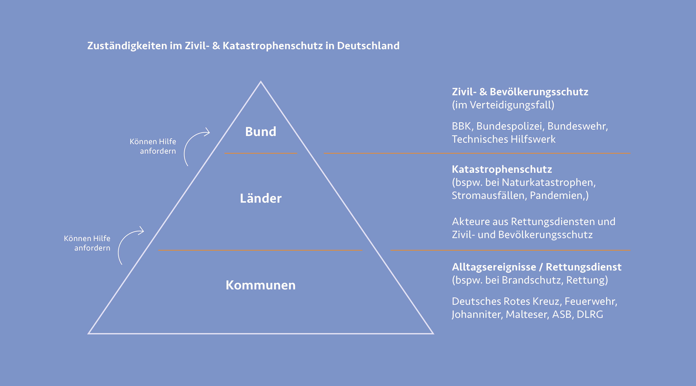

***
Der Bevölkerungsschutz und die Gewährleistung der Sicherheit
für Bürgerinnen und Bürger ist eine der Kernaufgaben des Staates.
Notsituationen entstehen meist plötzlich und unerwartet und
stellen Bürger:innen oft vor immense Herausforderungen oder
gar in Gefahrensituationen. Notlagen können etwa bei Naturkatastrophen
wie Waldbränden oder Fluten, durch Seuchen, bei
terroristischen Anschlägen und Kriegen oder den Auswirkungen
von Pandemien auftreten. Sichere Verhältnisse zu schaffen, ist
in solchen Situationen die höchste Priorität. Hier greift der
Bevölkerungsschutz. Er ist Aufgabe von Bund, Ländern und
Kommunen, welche jeweils für unterschiedliche Aufgabenfelder
innerhalb des Bevölkerungsschutzes verantwortlich sind. Die
einzelnen Verwaltungen sind eng miteinander abgestimmt, um
im Ernstfall eine bestmögliche Kommunikation und Bereitstellung
von Mitteln jeglicher Art zu ermöglichen. [^1]

 
<b> Krisenmanagement </b> 

Um außergewöhnliche Gefahren- oder Schadenlagen abzuwenden,
werden vom Bund Maßnahmen und Vorkehrungen erarbeitet und
geplant. Diesen systematischen Umgang mit Notsituationen
bezeichnet man als Krisenmanagement. Durch eine detaillierte
Planung kann in Krisensituationen eine flüssige und effektive
Schadenbekämpfung und Hilfe für Betroffene gewährleistet
werden. Das Krisenmanagement umfasst eine breite Zusammenarbeit
von Partner:innen und Kommunikationswegen innerhalb
Deutschlands, aber auch im Ausland. Das System wird
kontinuierlich verbessert und angepasst.

 
<b> Unterscheidung zwischen Zivil- und Katastrophenschutz </b>

Kann sich die Bevölkerung nicht selbst helfen und es besteht die
Gefahr für Bürgerinnen und Bürger, greift der Zivil- und Katastrophenschutz.
Durch das Zivil- und Katastrophenschutzgesetz
(ZSKG) sind die Zuständigkeiten für Bund und Länder klar definiert.
Der Bund hat seine Zuständigkeit im Zivilschutz und schützt die
Bevölkerung vor kriegsbedingten Gefahren. Der Katastrophenschutz
fällt hingegen in die Zuständigkeit der Länder und sorgt
für Schutz vor Unglücken in Friedenszeiten. Der Katastrophenschutz ist Teil der allgemeinen Gefahrenabwehr und unterliegt laut Artikel 70 GG den Ländern. Ansprechpartner:
innen für Bürger:innen sind Städte, Gemeinden, freie
Landkreise und Kommunen. Bei der Bewältigung von lokalen
Problemen sind Feuerwehren, Polizei und Ordnungsbehörden
beteiligt. Zusätzlich stehen freie Rettungsdienste wie etwa der
Arbeiter-Samariter-Bund (ASB), die Deutsche Lebens-Rettungs-
Gesellschaft e.V. (DLRG), das Deutsche Rote Kreuz (DRK), die
Johanniter und die Malteser zur Verfügung. Sollten Länder Polizeikräfte aus anderen Bundesländern oder Hilfskräfte aus der Verwaltung, wie etwa dem THW zur Unterstützung benötigen, können sie diese mit Hilfe des Artikel 33 GG anfordern. Auch
Streitkräfte können so angefordert werden.

Der Zivilschutz fällt in die Zuständigkeit des Bundes, festgehalten
im Artikel 73 Nr. 1 GG. Der Bund steht mit den einzelnen Ländern
in engem Austausch und kann auf Einheiten und Einsatzkräfte
der allgemeinen Gefahrenabwehr zugreifen. Die Kernaufgaben
des Zivilschutzes ist es, wichtige Ziele mit nichtmilitärischen
Maßnahmen vor kriegerischer Zerstörung zu bewahren und die
Auswirkungen von Kriegsschäden möglichst gering zu halten
und zu beseitigen. Wichtige Ziele, die es zu schützen gilt, sind
unter anderem die Bevölkerung, Wohnungs- und Arbeitsräume,
versorgungs- verteidigungswichtige Anlaufstellen, Betriebe und
Einrichtungen und der Schutz von Kulturgut. In einem etwaigen
Kriegsfall versorgt der Bund Einsatzkräfte mit entsprechender
Technik, Ressourcen, Ausbildung und den nötigen Geldern. Der
Bund hat im Katastrophenschutz keine Zuständigkeit. Sollten
Länder im Notfall allerdings Hilfe für den Katastrophenschutz
anfordern, kann der Bund Mittel und Ressourcen aus dem Zivilschutz
bereitstellen und direkt an die Länder ausliefern. [^2]

[^3]

Bund, Länder und Hilfsorganisationen arbeiten in engem Austausch
miteinander, um den bestmöglichen Schutz der Bevölkerung
zu gewährleisten. Sollten bei lokalen Ereignissen auf
Länderebene weitere Ressourcen oder Gelder für den Zivilschutz
benötigt werden, können die Länder auf Mittel des Zivilschutzes
des Bundes zurückgreifen. Im Gegenzug stellen Hilfsorganisationen,
welche für die Länder tätig sind, dem Bund im Verteidigungsfall
Kräfte und Fähigkeiten zur Verfügung. Um die diversen Aktivitäten
und Prozesse bestmöglich zu planen und die unterschiedlichen
Verwaltungsebenen zu koordinieren, dient das sogenannte
„integrierte Hilfeleistungssystem“. Es arbeitet zudem mit Feuerwehren,
Hilfsorganisationen und dem Technischen Hilfswerk
zusammen, damit Helfende und Material schnellstmöglich den
Bürgerinnen und Bürgern vor Ort zur Verfügung stehen können. [^4]

Um die Zusammenarbeit der unterschiedlichen Akteure im
Bevölkerungsschutz zu verbessern und zu aktualisieren, wurde
die LÜKEX (Länder- und Ressortübergreifende Krisenmanagementübung
(Exercise)) ins Leben gerufen. Diese Krisenübungen
finden in Deutschland seit 2004 in kontinuierlichen Intervallen
statt. Sie soll das gemeinsame Krisenmanagement von Bund,
Ländern, Hilfsorganisationen und den Betreibenden kritischer
Infrastrukturen (KRITIS) strategisch verbessern. Durch gemeinsame
Übungen an realitätsnahen Krisensimulationen, kann die
Zusammenarbeit der einzelnen Akteure und spezifischen Abläufe
in krisennahen Situationen genau geprobt und verbessert werden.
Somit können Entscheidungen im Ernstfall schneller und im
Sinne der Bevölkerung umgesetzt werden. [^5]

[^1]: [Vgl. Bundesministerium des Innern und für Heimat: Bevölkerungsschutz, 2024, <i> <u> https://
www.bmi.bund.de/DE/themen/bevoelkerungsschutz/bevoelkerungsschutz-node.html]()</u></i>
[^2]: [Vgl. Bundesministerium des Innern und für Heimat: Zivil- und Katastrophenschutz,
2024, Quelle <i> <u> https://www.bmi.bund.de/DE/themen/bevoelkerungsschutz/zivil-und-katastrophenschutz/
zivil-und-katastrophenschutz-node.html]()</u></i>
[^3]: [Abb.: Zuständigkeiten im Bevölkerungsschutz<i> <u> https://link.springer.com/chapter/10.1007/978-3-662-44635-5_4]()</u></i>
[^4]: [Vgl. Bundesministerium des Innern und für Heimat: Zivil- und Katastrophenschutz,
2024, Quelle <i> <u> https://www.bmi.bund.de/DE/themen/bevoelkerungsschutz/zivil-und-katastrophenschutz/
zivil-und-katastrophenschutz-node.html]()</u></i>
[^5]: [Vgl. Bundesamt für Bevölkerungsschutz und Katastrophenhilfe: Krisenübung für den
Bevölkerungsschutz, 2024, <i> <u> https://www.bbk.bund.de/DE/Themen/Krisenmanagement/
LUEKEX/luekex_node.html]()</u></i>