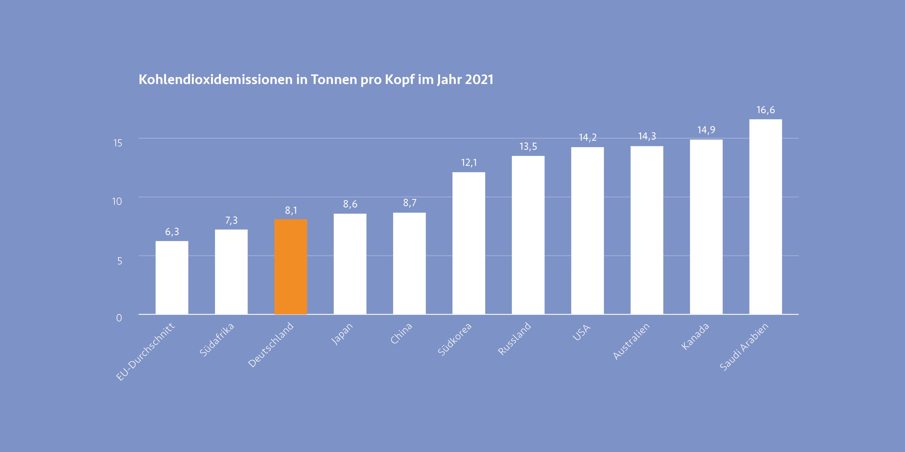

***
Krise ist nicht gleich Krise. Jede Krisensituation ist unterschiedlich
und kann durch viele Punkte differenziert werden. Auch die Dauer
der Krise kann ausschlaggebend über eine Einordnung sein.
Zählen Starkregen, Sturmfluten und Erdrutsche zu kurzen,
punktuellen Krisen, kann man den menschengemachten Klimawandel
zur langanhaltenden Bedrohung zählen, die über einen
längeren Zeitraum Menschenleben und Existenzen bedroht.
Auch Kriege und daraus resultierende Fluchtbewegungen sind
durch ihre Dauer differenzierter zu betrachten.

 
<b> Klimawandel – Brandbeschleuniger für Krisen </b>

Überflutungen in Afrika, Hitzewellen in Amerika und Asien, Flächenbrände
in Australien und Kanada und Extremwetter weltweit.
Allein die vergangenen Jahre zeichnen ein dramatisches Bild der
Auswirkungen der Klimakrise. Sie vernichtet Lebensgrundlagen,
gefährdet Menschenleben und schürt Konflikte über knappe
Ressourcen, oft in Regionen in denen das Leben ohnehin schon
herausfordernd sein kann. Für Millionen von Menschen bedrohen
diese Auswirkungen ihre Existenz und ihren Lebensraum. Beim
Thema des menschengemachten Klimawandel geht es nicht
nur um ein Umweltphänomen, sondern um die Bedrohung für
Frieden und Sicherheit in der Welt. [^1]

Seit Beginn des 21. Jahrhunderts, haben sich die Treibhausgasemissionen
in der Atmosphäre, durch den Anstieg der ausgestoßenen
CO2-Emissionen deutlich erhöht. Einen signifikanten
Einfluss haben dabei Schwellen- und Industrieländer. [^2]  So waren
etwa die G20-Staaten im Jahr 2021 für 81% der ausgestoßenen
CO2-Emissionen verantwortlich. Das entspricht einem Wert
von 38 Milliarden Tonnen. Gemessen an den Einwohner:innen hat Saudi-Arabien mit 16,6 Tonnen den höchsten Pro-Kopf Ausstoß. Danach folgen Kanada, Australien, die USA und Russland.
Deutschland landet mit 8,1 Tonnen pro Kopf auf Platz 9 des weltweiten Rankings. [^3]

[^4]

Menschen aus Ländern im globalen Süden sind am stärksten
von den direkten Auswirkungen des Klimawandels betroffen.
Die steigenden Temperaturen, die von den Treibhausgasen in der
Atmosphäre befeuert werden, haben Einfluss auf das Wetter und
können Wetterextreme hervorrufen, welche Naturkatastrophen
zur Folge haben können.

Überschwemmungen und Starkregen hängen von mehreren
Faktoren ab. Durch das Schmelzen der Gletscher und Eisvorkommen
auf der Erde, in Folge der erhöhten Temperatur,
kommt es zu einem Anstieg des Meeresspiegels, wobei gerade
tiefliegenden Inselstaaten Lebensgrundlagen genommen werden.
Außerdem verdunstet durch die erwärmte Atmosphäre deutlich
mehr Wasser aus den Weltmeeren und sammelt sich in gewaltigen Wolken, die längeren und stärkeren Regen zur Folge haben können. Besonders heikel wird es, wenn die Böden, auf die der
Starkregen trifft, ohnehin ausgetrocknet sind. Der trockene
Boden kann die hohe Niederschlagsmenge nicht aufnehmen
und oft sind Erdrutsche oder Flutkatastrophen die Folgen. [^5]
Auch die Intensität und Schäden in Folge von Hurrikans und
Tropenstürmen dürften sich durch die wärmeren Meere, im
vergleich zu den vergangenen Jahrzehnten, verstärken. Angesichts
des Ausbleiben von Niederschlägen erhöht sich zudem
die Wahrscheinlichkeit für Trockenheit. Es folgen Dürren und
Waldbrände, die gerade in ärmeren oder ohnehin schon sehr
heißen Regionen der Erde Hungersnöte und Krankheiten auslösen
können.

Naturkatastrophen in Folge des Klimawandels zerstören oft
ganze Lebensgrundlagen. Durch Dürren, Überschwemmungen
und Stürme, kommt es häufig zu Ernteausfällen. Die Bevölkerung
kann den Bedarf an Lebensmitteln nicht mehr gewährleisten und
ist auf Humanitäre Hilfe angewiesen. Die Versorgung in abgelegene
Gebiete ist allerdings schwierig und dauert lange. Eine Fluchtbewegung
der Bevölkerung kann die Folge sein. [^6]

Eine weitere Folge, durch die Zerstörung von klimawichtigen
Regenwäldern und Mooren, ist die Verbreitung von Zoonosen.
Infolge durch Eindringen und Verdrängen in die bis dahin noch
unberührte Natur, werden viele Tiere aus ihrem gewohnten
Umfeld vertrieben und müssen in fremde oder unübliche Gebiete
ausweichen. Häufig kommen Menschen so in Kontakt mit Tieren,
die Krankheitserreger übertragen, gegen die der Mensch nicht
immun ist. Man spricht von Epidemien. Beispiele aus der näheren
Vergangenheit sind SARS-CoV-2 oder Affenpocken aber auch
Ebola, AIDS, Tollwut oder die Vogelgrippe zählen dazu.

Eine Studie aus dem Jahr 2012 geht davon aus, dass pro Jahr etwa
2,7 Millionen Todesfälle auf Zoonosen zurückzuführen sind. Die
umgangssprachlich als Coronavirus bekannte Virusinfektion wurde
sehr wahrscheinlich von Fledermäusen auf den Menschen übertragen.
[^7]  Bis zum Ende des Jahres 2022 hatte das Coronavirus
weltweit bereits knapp 6,7 Millionen nachgewiesene Todesfälle
im Zusammenhang mit der Krankheit. [^8]

Den Klimawandel merken wir in unserem Alltag kaum, jedoch
sind dessen Auswirkungen und Folgen die wohl größte Bedrohung
und Existenzgefährdung, die es in der Menschheitsgeschichte je
gab. Durch die Folgen des Klimawandels sind Millionen Menschen
bedroht, was zu immer mehr Fluchtbewegungen und Migration
bei immer kleiner werdenden Lebensräumen führt. Sollte die
Reduzierung der Emissionen in den kommenden Jahrzehnten
nicht deutlich eingedämmt werden, führt der Zustand unwiderruflich
zur größten ökologischen und humanitären Krise der Welt.
Diese kann Auslöser für weitere Krisen und Katastrophen wie
Sturmfluten, Starkregen, Erdrutsche und Überschwemmungen
sein wird.

[^1]: [Vgl. Auswärtiges Amt: Klimawandel – die größte Sicherheitsbedrohung unserer Zeit,
2024, <i> <u> https://www.auswaertiges-amt.de/de/aussenpolitik/klimaaussenpolitik/klimasicherheit/
2179664]()</u></i>
[^2]: [Vgl. European Comission: EDGAR - Emissions Database for Global Atmospheric Research,
2022, <i> <u> https://edgar.jrc.ec.europa.eu/report_2022#emissions_table]()</u></i>
[^3]: [Vgl. Statistisches Bundesamt: Treibhausgase der G20, 2022, <i> <u> https://www.destatis.de/
DE/Themen/Laender-Regionen/Internationales/Thema/umwelt-energie/umwelt/
G20_CO2.html]()</u></i>
[^4]: [Abb.: Emissionen Ranking weltweit <i> <u> https://www.destatis.de/DE/Themen/Laender-Regionen/Internationales/
Thema/umwelt-energie/umwelt/G20_CO2.html]()</u></i>
[^5]: [Vgl. Welthungerhilfe: Naturkatastrophen und der Klimawandel, <i> <u>  https://www.welthungerhilfe.
de/informieren/themen/klimawandel/naturkatastrophen]()</u></i>
[^6]: [Vgl. Welthungerhilfe: Naturkatastrophen und der Klimawandel, <i> <u>  https://www.welthungerhilfe.
de/informieren/themen/klimawandel/naturkatastrophen]()</u></i>
[^7]: [Vgl. Institut für Virologie Charité: Drei aus Fünf, 2020, <i> <u>  https://www.zoonosen.net/
forschungsnetz/newsletter/07_2020/Artikel2]()</u></i>
[^8]: [Vgl. Statista: Weltweite Zahl der Todesfälle in Zusammenhang mit dem Coronavirus
(COVID-19) seit Februar2020, 2024, <i> <u> https://de.statista.com/statistik/daten/studie/
1103240/umfrage/entwicklung-der-weltweitentodesfaelle-aufgrund-des-coronavirus/]()</u></i>