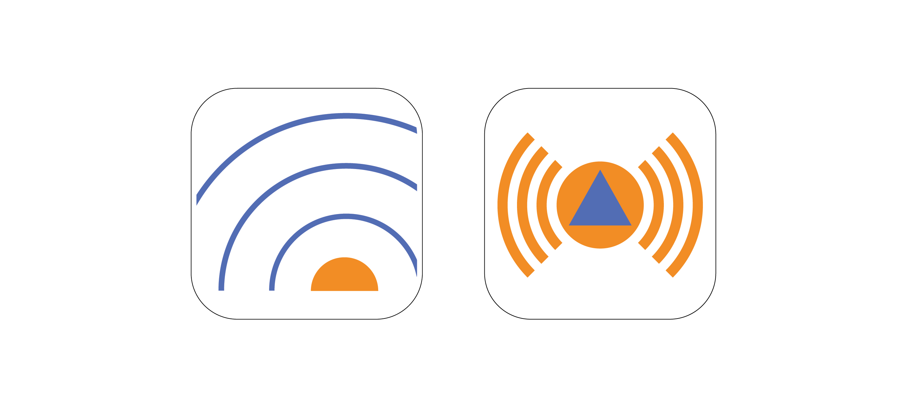
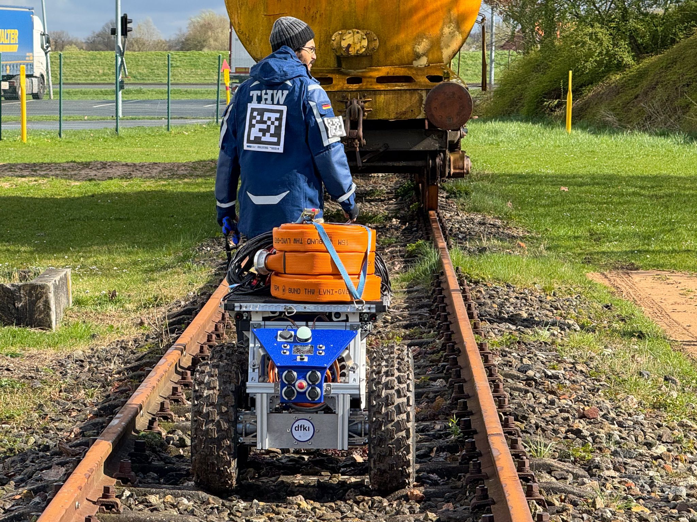
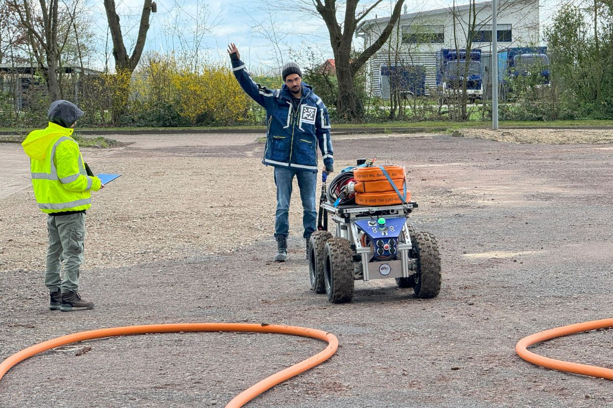
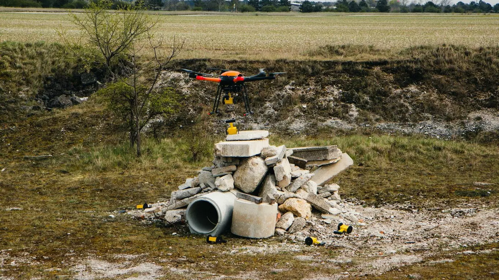
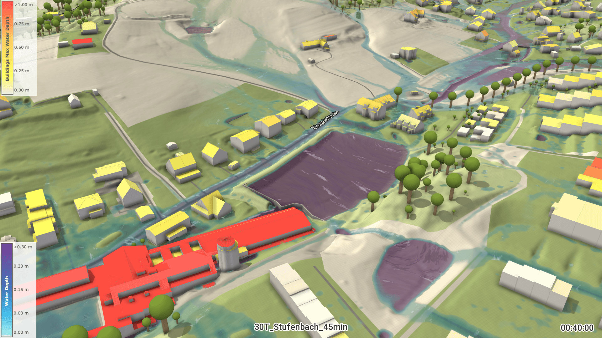

***
Genau wie in anderen Bereichen des gesellschaftlichen Lebens
und der Wirtschaft gibt es auch im Bevölkerungsschutz innovative
Entwicklungen, Systeme und Lösungsansätze, welche Krisen
vorbeugen, ihre Auswirkungen abschwächen oder bei der Wiederherstellung
der Infrastruktur helfen. Wichtig ist die stetige
Weiterentwicklung von Aktionsplänen und die Zusammenarbeit
von unterschiedlichen Bereichen, um die Resilienz der Bevölkerung
weiter zu stärken und den Bevölkerungsschutz zu verbessern. Im
folgenden werden Lösungsansätze vorgestellt, die sich aktuell
in der Planung oder bereits in Tests unter realen Bedingungen
befinden.

 
<b> Taktische Zeichen </b>

Als Taktische Zeichen bezeichnet man Symbole, die im Katastrophenschutz
von Behörden oder Organisationen mit Sicherheitsaufgaben
eingesetzt werden. Sie dienen der einheitlichen
Kommunikation und graphischen Darstellung auf Lageplänen,
Einsatzkarten oder Stärkemeldungen. Taktische Zeichen basieren
auf der Grundlage von militärischen Zeichen und bestehen meist
aus geometrischen Grundformen, welche die Obergruppen der
unterschiedlichen Zeichen bilden. Taktische Zeichen werden etwa
von Polizei, Feuerwehr, THW, Rettungsdiensten und weiteren
Akteuren im Zivil- und Katastrophenschutz eingesetzt.
Seit der Einführung in der Bundeswehr 1968 wurden die taktischen
Zeichen im Katastrophenschutz kontinuierlich angepasst und
erweitert. Seit 2012 empfiehlt die Ständige Konferenz für Katastrophenvorsorge
und Katastrophenschutz (SKK), eine einheitlich
festgeschriebene Symbolsammlung für den Katastrophenschutz,
welche in der Dienstvorschrift (DV) 102 festgeschrieben ist. Die
DV 102 wird heute von nahezu allen Akteuren des Katastrophenschutzes
in Deutschland verwendet und ermöglicht eine schnelle,
übergreifende Kommunikation im Krisenfall mit allen Beteiligten.
Auch folgt sie den Regeln, der für die NATO bestimmten taktischen
Zeichen, was einen Austausch auf internationaler Ebene erleichtert. [^1]

Für außenstehende Personen ist das System der taktischen
Zeichen wenig intuitiv, doch es verfolgt ein stetiges Muster.
Grundsätzlich gibt es die graphische Formsprache der Zeichen
und zusätzlich eine mögliche Farbcodierung, die weitere Informationen
bereitstellen kann. Dabei tragen wichtige Ziele im
Krisenmanagement wie etwa die Dienststelle, Führungsstelle,
Einrichtungen und Personen geometrische Formen. Mit einem
entsprechenden Farbcode können diese dann unterschiedliche
Zustände abbilden. Des Weiteren ist das System der taktischen
Zeichen ein offenes System und kann je nach Situation mit
zusätzlichen Informationen ergänzt oder modifiziert werden.
Dabei kann die Information innerhalb oder außerhalb der Zeichen
angebracht werden. Außerdem haben Institutionen und
Einrichtungen innerhalb des Krisenmanagements eindeutig
zuzuordnende Farben. So nutzt die Feuerwehr etwa einen roten
Untergrund, das Technische Hilfswerk einen blauen und Polizei
und Zoll einen grünen Untergrund zur eindeutige Erkennung, um
hier nur ein paar zu nennen. Bei der Darstellung von spezifischen
Aufgaben innerhalb der Gefahrenabwehr gibt es zahlreiche
Zeichen, die sich sehr vereinfacht an den Darstellungen der
Geräte oder Vorgänge orientieren. [^2]

Durch die meist abstrakte Darstellung der Zeichen oder Tätigkeiten
lassen sich für Unbeteiligte Personen oft nur wenige Anhaltspunkte
für ihre wahre Bestimmung erahnen. Das unterscheidet
die taktischen Zeichen grundlegend von gängigen Piktogrammen.
Wobei Piktogramme auf die eindeutige Erkennbarkeit und Identifikation
von Zielen oder Tätigkeiten abzielen, haben taktische
Zeichen die Aufgabe Prozesse oder Ziele im Krisenmanagement
graphisch eindeutig und einfach für geschulte Personen bereitzustellen.
Sie sollen die Arbeit der verschiedenen Akteure untereinander
vereinfachen und ein möglichst genaues Lagebild des jeweiligen
Situation abbilden. Ein weiterer Vorteil der taktischen Zeichen
bietet die Darstellung ohne weiteren Beschreibungstext. So können Informationen direkt von Helfenden auf Lagekarten aufgenommen werden und es bedarf keine zusätzliche Erläuterung
durch Personen oder Textform.

Auch hier zeigt sich, dass der Einsatz von einheitlich gelernten
Zeichen einen positiven Effekt auf die schnelle Erkennbarkeit hat
und Institutionsübergreifend verstanden werden kann. Auch im
internationalen Zusammenspiel können so Informationen und
eine Einheitliche Darstellung klar und eindeutig vermittelt werden,
selbst wenn Sprachbarrieren den Austausch von Berichten oder
Texten erschweren. Auch der Einsatz von Farbe und einer dementsprechenden
Codierung findet sich in der Gestaltung allgemeiner
Leitsysteme wieder und zeigt den positiven Einfluss von farblichen
Einteilungen für unterschiedliche Bereiche und Aufgaben. Gerade
im Krisenmanagement ist Zeit eine kostbare Ressource und sollte
möglichst zielführend eingesetzt werden, wobei taktische Zeichen
und Piktogramme sowohl für Helfende als auch für Betroffene
Personen eine wichtige Stütze sind.

Ich kann hier nur einen kleinen Einblick in den Bereich der taktischen
Zeichen geben und das Thema lediglich anreißen. Eine ausführliche
Beschreibung mit allen aktuellen taktischen Zeichen und deren
farblicher Erkennung, findet sich in der Dienstvorschrift 102.

[^3]
[^4]

 
<b> Warn-Apps </b>

Um die Bevölkerung vor nahenden Schadenereignissen zu warnen,
gibt es nicht nur altbekannte Methoden wie Sirenen, Radio,
Fernsehen oder Durchsagen der Einsatzkräfte. In den letzten
Jahren wurde die Nutzung von Warn-Apps für das Smartphone
weiter vorangetrieben. Die beiden genutzten Apps des Katastrophenschutzes
in Deutschland sind die App „NINA“ und die
„KATWARN“-App. Diese können im Notfall Warnmeldungen
direkt auf die Mobiltelefone von Bürgerinnen und Bürgern in
betroffenen Gebieten senden und diese vor anstehende Gefahren
warnen. Die Apps unterscheiden sich leicht voneinander. Die
Warn-App Nina wurde vom Bundesamt für Bevölkerungsschutz
und Katastrophenhilfe (BBK) entwickelt. Sie bündelt Warnmeldungen
des deutschen Wetterdienstes, des Bevölkerungsschutzes
als auch Hochwassermeldungen der Länder. Die Warnmeldungen
können dann für Orte oder Umkreise freigeschaltet werden. Zudem
können bundesweit ausgerufene Gefahren auf einer Karte eingesehen
werden.

Die Entwicklung der KATWARN-App wurde durch öffentliche
Versicherer und des Fraunhofer-Institut umgesetzt. Sie bezieht
ihre Daten von Bund, Ländern und Behörden, sowie Betreibern
kritischer Infrastruktur wie der Feuerwehr, Polizei, und Hochwasser-
und Erdbebenzentralen. Es können themenbezogene
Hinweise, aber auch Hinweise zu Großveranstaltungen beispielsweise
Festivals abgerufen werden. Auch die KATWARN-App gibt einen
Überblick über aktuelle Gefahrenstellen im ganzen Land und kann
zudem im europäischen Ausland genutzt werden. [^5]

[^6]

 
<b> Cell-Broadcast </b>

Mit der Einführung des Cell Broadcast-Systems im Februar 2023
wurde ein lange geplantes Vorhaben des Bundes umgesetzt. Das
Cell Broadcast-System sendet wie auch die Warnapps Warnmeldungen
auf das Smartphone. Die Installation einer Warnapp
wie Katwarn oder Nina, sowie eine aktive Internetverbindung sind
jedoch nicht nötig, was die Erreichbarkeit innerhalb der Bevölkerung
erhöhen soll. Wird in bestimmten Regionen ein Alarm
ausgelöst, sendet das System einen Signal an alle Smartphones,
die sich zum Zeitpunkt in den Zellen der Netzbetreiber befinden.
Die Warnmeldung wird, anders als bei herkömmlichen SMS,
direkt lesbar im Sperrbildschirm angezeigt. Zusätzlich ertönt
ein lauter Warnton über die Lautsprecher des Smartphones
und der Vibrationsalarm wird ausgelöst, unabhängig von den
Einstellungen der Nutzerinnen und Nutzer. Die Nachrichten
werden über das Standard SMS-CB Netz versendet, welches das
normale Mobilfunknetz im Notfall nicht überlastet. Allerdings
gibt es auch Szenarien, die eine präzise Warnung verhindern
können. So werden keine Warnmitteilungen gesendet, wenn die
Nutzer:innen keinen Netzempfang haben, sich das Smartphone
im Flugzeugmodus befindet, der Akku leer ist oder keine SIMKarte
eingelegt wurde. [^7]

 
<b> Modulares Warnsystem MoWaS </b>

Um die Bevölkerung auf möglichst vielen Wegen erreichen zu
können, wurde das Modulare Warnsystem (MoWaS) entwickelt.
Das MoWaS wurde deutschlandweit 2011eingeführt und löste das
Satellitengestützte Warnsystem (SatWaS) ab. Mit insgesamt
132 Sende- und Empfangsstationen deckt das System das gesamte
Bundesgebiet ab. Das MoWaS gibt Warnungen über Feuer,
Gefährdung der Versorgung und Infrastruktur, öffentliche
Sicherheit, Wetterereignisse und biologische, chemische, sowie
radioaktive Gefahren ab. Das MoWaS ist so konzipiert, dass gesendete
Warnmeldungen auf möglichst vielen Plattformen und
Medien ausgegeben werden. So gibt es Schnittstellen zu Radio,
Fernsehen, Internetseiten in betroffenen Gebieten, aber auch zu Warn-Apps wie Nina oder Katwarn und dem Cell Broadcast-
System. Zudem ist das System in der Lage Textnachrichten auf
digitale Werbetafeln im Stadtgebiet, Fahrgastanzeigen im öffentlichen
Nahverkehr und sogar Taxi-Dach-Werbung auszuspielen.
Außerdem können stationäre Sirenensysteme im gesamten
Bundesgebiet mit entsprechenden Warnmeldungen bespielt
werden. Durch die Übertragung der Warnmeldungen via Satellit,
ist eine Erreichbarkeit der Krisengebiete auch bei Stromausfällen
gewährleistet. Das MoWaS sendet mit jeder Warnmeldung auch
einen sogenannten Event-Code. Dieser regelt die Darstellung auf
dem jeweiligen Endmedium je nach Gefährlichkeit der Meldung.
Auch die Übersetzung in andere Sprachen ist durch den Instruction-
Code bestimmt und lässt die Meldungen am Smartphone der
Betroffenen Personen in der jeweils eigens festgelegten Sprache
erscheinen. [^8]

Das Mobile Warnsystem ist eine elementare Schnittstelle
zwischen Behörden und Betroffenen, die stetig erweitert und
verbessert wird, damit im Ernstfall möglichst viele Menschen
vor anstehenden Gefahrenlagen gewarnt werden können.

 
<b> Bundesweiter Warntag </b>

Um die Warnsysteme zu testen, wurde der sogenannte „Bundesweite
Warntag“ ins Leben gerufen. Dieser findet immer am dritten
Donnerstag im September statt und beinhaltet die Auslösung
aller Warnmittel, die für den Katastrophenschutz zur Verfügung
stehen. Diese sind unter anderem die Warnapps Katwarn und
Nina, sowie das Cell Broadcast-System, aber auch über Radio
und Fernseher werden Warnungen abgespielt. Außerdem steht
es den teilnehmenden Landkreisen und Kommunen frei, ihre
stationären Warnmittel wie Sirenen oder Lautprecherwagen
einzusetzen. Am Ende der Warnübung erfolgt eine Entwarnung
über die selben Kanäle. Neben der Erprobung der Warninfrastruktur
unter realen Bedingungen wird der Bevölkerung auch Wissen rund
ums Thema bereitgestellt. [^9]

Durch andauernde Verbesserungen, Pannen im Vorjahr und den
Nachwirkungen der Flutkatastrophe 2021 im Ahrtal fiel der Warntag
im selben Jahr aus. Der Warntag 2022 konnte allerdings laut
Angaben des Bundesamtes für Bevölkerungsschutz und Katastrophenhilfe
(BBK) mehr als 90 Prozent der Bevölkerung über
mindestens ein Warnmedium erreichen, was eine durchaus
zufriedenstellende Statistik bestärkt. [^7]

 
<b> Roboter als mechanische Helfer </b>

Die Sicherheit von Rettungskräften im Katastrophenschutz hat
oberste Priorität und muss unter allen Umständen und zu jeder
Zeit gewährleistet werden. Um Betroffenen zu helfen, bei denen
der Einsatz von menschlichen Einsatzkräften zu gefährlich ist, wird
aktuell die Unterstützung durch Roboter getestet. Das Robotics
Innovation Center des deutschen Forschungszentrums für Künstliche
Intelligenz (DFKI) hat in Zusammenarbeit mit dem THW einen
teilweise autonom agierenden Roboter entwickelt. Dieser hochmoderne
Assistenzroboter wurde für den autonomen Materialtransport
zwischen zwei Punkten entwickelt und reagiert auf
Gestensteuerung der Einsatzkräfte. In bereits erfolgreich absolvierten
Tests des THW hat der Roboter namens „Kratos“ eine Reihe an
Übungen durchlaufen. Er hat etwa einen 120 Kilogramm schweren
Generator befördert, konnte Bahngleise problemlos überwinden
und einen Deichhügel erklimmen. Auch bei schlechter Sicht und
Dunkelheit konnte der Roboter einwandfrei auf Signale der Einsatzkräfte
reagieren. Nach der Evaluation der erhobenen Daten soll der
kleine Helfer weiter verbessert werden, um den Rettungskräften
möglichst zeitnah bei realen Situationen zur Verfügung zu stehen.

Das Projekt ROMATRIS, welches für die Entwicklung des Roboters
zuständig ist, startete 2021 und wurde mit einem Budget von
1,46 Millionen Euro und einer Laufzeit von 4 Jahren vom THW
unterstützt. Die positiven Ergebnisse bestätigen die enge Zusammenarbeit
zwischen dem DFKI und dem THW und zeigen die Notwendigkeit
von intensivem Austausch zwischen unterschiedlichen
Forschungseinrichtungen. Zusätzlich werden durch die Realsituationen praxisnahe Begebenheiten simuliert und eine bessere Ausgangslage für weitere Verbesserungen am System getroffen.
Das System wird auch weiterhin daran arbeiten Einsatzkräfte
zu entlasten und kritischen Situationen schnell und effektiv
entgegenzutreten, so Tom Becker, Leiter des Forschungsprojektes
ROMATRIS. [^10]

[^11]
[^11]

 
<b> Innovative, interkulturelle Entwicklung </b>

Um Helfende bei der Suche und Bergung von Vermissten mit
innovativen, technischen Hilfsmitteln zu unterstützen, wurde
das europäisch-japanische Forschungsprojekt „Cursor“ (Coordinated
Use of miniaturised Robotic equipment and advanced
Sensors for search and rescue Operations) ins Leben gerufen.
Das seit 2019 laufende Projekt wird durch die Europäische Kommission
und der Japan Science and Technology Agency gefördert
und arbeitet mit Forschungsinstitutionen, Universitäten und
Einsatzkräften mehrerer europäischer Länder und Japan zusammen,
um neue, technische Lösungen im Bevölkerungsschutz zu
erarbeiten.

Das erarbeitete System soll sowohl im Zusammenspiel als auch
modular einsetzbar sein und läuft wie folgt ab:

Beim eintreffen im Krisengebiet wird durch den Einsatz verschiedener
Drohnen ein Lagebild der vorherrschenden Situation erstellt. Sollte
Strom und Internet in den betroffenen Regionen ausgefallen oder
überlastet sein, so wird ein funktionsfähiges Kommunikationsnetzwerk
erstellt. Sind die technischen Voraussetzungen vorhanden,
werden kleine, robuste Roboter durch Drohnen in die verschütteten
Gebiete geflogen, um nach Vermissten oder Verschütteten zu
suchen. Durch ihre kleine, wendige und robuste Bauweise gelangen
die kleinen Helfer an Orte, an denen Einsatzkräfte nicht
ohne Weiteres suchen könnten. Zusätzlich zu Kameras, Mikrofonen
und Lautsprecher, um mit der Außenwelt kommunizieren zu
können, sind die Roboter mit C02-Sensoren ausgestattet um
Personen anhand ihres C02 Ausstoßes orten zu können. Das
Projekt arbeitet außerdem daran die einzelnen technischen
Geräte miteinander kommunizieren zu lassen. Es soll eine Kommunikationsinfrastuktur
entstehen und die gesammelten Daten
in einem Kontrollzentrum zusammengeführt und ausgewertet
werden. [^12]

Das Projekt Cursor wurde in enger Zusammenarbeit mit internationalen
Hilfsorganisationen und Helfenden erarbeitet. Das
professionelle und erfahrene Feedback der Helfenden konnte das
Projekt weiter vorantreiben und wichtige Lücken bei der Suche
und Ortung von Verschütteten schließen. Das Projekt Cursor
konnte nach mehrjähriger Zusammenarbeit zahlreicher Beteiligten
im Februar 2023 erfolgreich abgeschlossen werden. Die erarbeiteten
Lösungen kommen nun zuverlässig bei der Bewältigungen
von Naturkatastrophen wie Erdbeben oder Überschwemmungen
zum Einsatz. [^13]

[^14]
[^14]

 
<b> KI sorgt für Revolution des Hochwasserschutzes </b>

Der Einsatz von Künstlicher Intelligenz (KI) ist aus dem digitalen
Leben kaum mehr wegzudenken. KI unterstützt uns in diversen
Situationen und soll unser Erlebnis am Smartphone, Laptop oder
im Alltag angenehmer gestalten. Doch auch im Bereich der Wissenschaft
kann KI zum Problemlöser werden. Das Zentrum für Virtual
Reality und Visualisierung Forschungs-GmbH Wien (VRVis) tüftelt
schon seit 15 Jahren an einer leistungsstarken, KI-basierten
Berechnungssoftware für hydrodynamische Modellierung.
Die Simulationssoftware viscloud berechnet Hochwasser- und
Starkregenereignisse und wandelt die Daten in eine detailgetreue,
dreidimensionale Visualisierung der betroffenen Gebiete um.
Eine der herausragenden Eigenschaften des Systems ist nicht nur
die Kombination aus Simulation, Analyse und anschließender
Visualisierung, sondern auch die Geschwindigkeit von nur wenigen
Sekunden zur Visualisierung ganzer Städte und Regionen. Somit
können Vorhersagen für Gebiete in sekundenschnelle erstellt
und veranschaulicht werden, bei denen eine solche Berechnung
früher noch mehrere Stunden bis hin zu Tagen gedauert hat. Die
Visualisierung setzt auf ein detailliertes, interaktives 3D-Modell
und kann die errechneten Daten präzise und perfekt präsentieren.
Das VRVis hat im Auftrag des österreichischen Bundesministeriums
für Landwirtschaft, Regionen und Tourismus bereits die komplette
Fläche Österreichs durch eine Hochwasserrisikozonierung erfasst
und visualisiert. Auch das Bundesland Rheinland-Pfalz und die
Stadt Köln setzen auf die innovative Technik. Sie soll bei der
Prognose blitzschnell wichtige Daten liefern und die Entscheidungsfindung
im Ernstfall unterstützen. Doch das System viscloud
soll nicht nur für offizielle Stellen genutzt werden. Die Software
soll unter anderem Ingenieurbüros, Einsatzpersonal und der
Öffentlichkeit zur Verfügung stehen, um Hochwassersicher zu
planen oder sich die Hochwasservorhersage für die eigene
Region anzeigen zu lassen. Somit ist viscloud nicht nur bei der
Vorhersage von Starkregenereignissen und der Berechnung von
Evakuierungsgebieten, sonder auch bei der Hochwassersensiblen
Stadtentwicklung von großer Bedeutung. Bei der Version für
Bürgerinnen und Bürger soll eine benutzerfreundliche Visualisierung
im Browser zur Verfügung stehen. [^15]

Das System nutzt eine Vielzahl an bestehender Daten und führt
diese in einer hydrodynamischen Modellierung zusammen. Unter
anderem werden Daten aus hochauflösenden Geländemodellen,
dem Gebäudekataster, Kanalnetzdaten, Pegeldaten, Niederschlagsdaten,
Daten zur Flusssohle und mehr miteinander berechnet und
zusammengeführt. [^16]

Auch Google hat ein KI-Tool zur Berechnung und Warnung von
Hochwasserereignissen vorgestellt. Auch hier sehen Expert:innen
hohes Potential gegenüber herkömmlichen oft sehr träge funktionierenden
Berechnungen. Die Daten müssen bei herkömmlichen
Berechnungen für einzelne Regionen händisch angewandt werden
und die daraus resultierende Berechnung nimmt oftmals eine
sehr lange Zeit in Anspruch. Bei Ki-gestützten Systemen gelinge
das in einem flächendeckenden Maß in wenigen Sekunden.
Außerdem würden so auch kleinere Ortschaften und abgelegenere
Gebiete schneller berechnet und gewarnt werden, da die Berechnung
mit aktuellen Methoden zuerst an größere Städte gebunden
ist. Bis Kapazität für die Berechnung der Außenbezirke oder
angrenzender Gemeinden zur Verfügung steht, können oftmals
keine Warnungen oder Evakuierungen mehr vorgenommen werden,
da diese häufig schon betroffen sind. [^17]

Künstliche Intelligenz ermöglicht auch in diesem Bereich neue
Möglichkeiten und setzt noch nie dagewesene Standards. Der
große Nachteil herkömmlicher Methoden war die Personengebundene
Datenerhebung und Einspeisung in die Systeme. Durch
neue Methoden wie etwa dem viscloud-System oder dem Google-
Tool können riesige Flächen blitzschnell berechnet und detailliert
visualisiert werden. Auch die Bereitstellung der Daten für öffentliche
Zwecke wie der Stadtentwicklung sogt langfristig für besseren
Hochwasserschutz und dementsprechend auch für weniger Gefahr
für Leib und Leben.

[^18]
[^18]

[^1]: [Vgl. Wikipedia: Taktische Zeichen, 2024, <i> <u> https://de.wikipedia.org/wiki/Taktische_Zeichen]()</u></i>
[^2]: [Vgl. DLRG: Taktische Zeichen im Bevölkerungsschutz, 2011, <i> <u> https://rheinland-pfalz.dlrg.
de/fileadmin/groups/10000000/Ressort_Einsatz/Dateien/DV102_DLRG_Taktische_Zeichen.
pdf]()</u></i>
[^3]: [Abb.: Grundlagen Taktische Zeichen <i> <u> https://rheinland-pfalz.dlrg.de/fileadmin/groups/10000000/Ressort_Einsatz/Dateien/DV102_
DLRG_Taktische_Zeichen.pdf]()</u></i>
[^4]: [Abb.: Taktische Zeichen <i> <u> https://bit.ly/3SWeXVe]()</u></i>
[^5]: [Vgl. NDR: Cell Broadcast und Warn-Apps NINA und KATWARN melden Gefahren, 2023, <i> <u> https://www.ndr.de/ratgeber/verbraucher/Cell-Broadcast-und-Warn-Apps-NINA-und-
KATWARN-melden-Gefahren,warnapps108.html]()</u></i>
[^6]: [Abb.: Warn-Apps <i> <u> https://www.ndr.de/ratgeber/verbraucher/Cell-Broadcast-und-Warn-
Apps-NINA-und-KATWARN-melden-Gefahren,warnapps108.html]()</u></i>
[^7]: [Vgl. MDR: Cell Broadcast – So kommt die Probewarnung aufs Handy, 2023, <i> <u> https://
www.mdr.de/nachrichten/deutschland/gesellschaft/warntag-warnsystem-cell-broadcastsmartphone-
100.html]()</u></i>
[^8]: [Vgl. Bundesamt für Bevölkerungsschutz und Katastrophenhilfe: MoWaS, 2024, <i> <u> https://
www.bbk.bund.de/DE/Warnung-Vorsorge/Warnung-in-Deutschland/MoWaS/mowas_
node.html]()</u></i>
[^9]: [Vgl. Bundesamt für Bevölkerungsschutz und Katastrophenhilfe: Bundesweiter Warntag,
2024, <i> <u> https://www.bbk.bund.de/DE/Warnung-Vorsorge/Bundesweiter-Warntag/bundesweiter-
warntag_node.html]()</u></i>
[^10]: [Vgl. Future4public: Innovation im Katastrophenschutz – Transportroboter Kratos, 2024, <i> <u> https://f4p.online/2024/05/22/innovation-im-katastrophenschutztransportroboterkratos/ ]()</u></i>
[^11]: [Abb.: Feldtest Romatris <i> <u> https://f4p.online/2024/05/22/innovation-im-katastrophenschutz-transportroboter-kratos/]()</u></i>
[^12]: [Vgl. CURSOR: CURSOR – Accelerating Search and Rescue operations, 2023, <i> <u> https://www.cursor-project.eu]()</u></i>
[^13]: [Vgl. Protector: Innovative Technologien im Katastrophenschutz, 2022, <i> <u> https://www.protector.de/innovativetechnologien-im-katastrophenschutz]()</u></i>
[^14]: [Abb.: Fesldtest Cursor <i> <u> https://www.protector.de/innovative-technologien-imkatastrophenschutz]()</u></i>
[^15]: [Vgl. Rheinland-Pfalz – Ministerium Klimaschutz, Umwelt, Energie und Mobilität: Künstliche Intelligenz, 2024, <i> <u> https://mkuem.rlp.de/service/pressemitteilungen/detail/katrin-eder-wasserwirtschaft-ist-innovationstreiber-undnutzt-kuenstliche-intelligenzauf-dem-weg-zur-klimaneutralitaet]()</u></i>
[^16]: [Vgl. vrvis: Projekt scenarify, 2024, <i> <u> https://www.vrvis.at/produkte-loesungen/produktelizenzen/
scenarify]()</u></i>
[^17]: [Vgl. nature: Global prediction of extreme floods in ungauged watersheds, 2024, <i> <u> https://
www.nature.com/articles/s41586-024-07145-1]()</u></i>
[^18]: [Abb.: Visualisierung Hochwasser <i> <u> https://www.vrvis.at/produkte-loesungen/produkte-lizenzen/scenarify]()</u></i>