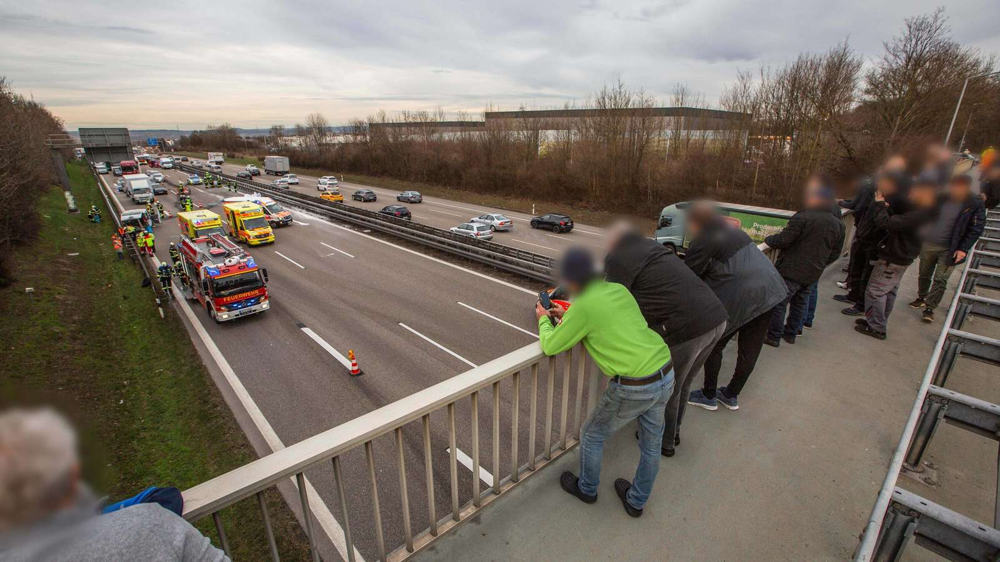

***
Krisen und Katastrophen sind für Betroffene und Helfende ohnehin
schon schlimm genug zu verkraften. Doch immer wieder ist von
sogenanntem „Krisentourismus“ oder auch „Dark tourism“ die
Rede. Diese Art von Tourismus beschreibt Schaulustige, die nach
Tragödien oder Naturkatastrophen in die betroffene Krisenregionen
fahren um sich dort das Ausmaß der Zerstörung anzusehen.
Dabei ist zu unterscheiden, dass sie keine Intention zur Hilfe
haben, sondern aus reiner Neugier und persönlichem Interesse
zum Unfallort fahren. Oft muss in Krisenregionen kurz nach
einer Katastrophe die Infrastruktur wiederhergestellt, Trümmer
beseitigt und nach Überlebenden gesucht werden. Solche
Krisentouristen, behindern oftmals die Bergungsarbeiten oder
verstopfen Zufahrts- und Rettungswege für Einsatzkräfte. [^1]
Nicht nur Einsatzkräfte, sondern auch Betroffene sind wütend
und fassungslos über eine solche Belustigung am Leid anderer.

Besonders nach der Flut im Ahrtal 2021 wurden vielerorts Gaffer
und Katastrophentouristen gemeldet. Schon am morgen des
15. Juli, während vielerorts noch die Evakuierungsmaßnahmen
und Bergung von Toten und Verletzten in vollem Gange waren,
appellierte die Polizei an Gaffer, sich vom Krisenherd zu entfernen
und Rettungswege für Einsatzkräfte freizuhalten. „Schaulustige
behindern den Rettungseinsatz im Bereich Schuld. Bitte
haltet die Rettungswege frei!!!!!“ schreibt die Polizei Koblenz
bereits 10:11 Uhr am 15. Juli 2021 über Twitter. [^2] Beamte riefen
mehrfach dazu auf, Straßensperren zu beachten, da die Gefahren
unvorhersehbar seien. Auch Polizeisprecher Ulrich Sopart meldete
sich per Twitter zu Wort: „Was die Hilfskräfte an den vielen Einsatzstellen
überhaupt nicht gebrauchen können sind Gaffer, von
denen einige offenbar nichts Eiligeres zu tun haben, als die Anfahrts- & Rettungswege zu belegen. Seht von nicht notwendigen
Besuchen ab!“ [^3] Auch von Plünderungsversuchen ist zu hören.
In Bad Neuenahr sind laut Jeanette Hennericis, die vor der Flut ein
Bekleidungsgeschäft im Ort betrieben hatte, an den Wochenenden
„scharenweise“ Schaulustige durch die verwüstete Gemeinde
gezogen. Dass diese Menschen nicht selbst Hand anlegen und
helfen, macht Jeanette sprachlos und kann sie nicht verstehen. [^4]

Laut des Polizeipräsidiums Koblenz können Schaulustige wirkliche
Probleme für betroffene Regionen darstellen. Die durch Einsatzkräfte,
Helferinnen und Helfer und Betroffene verursachten
Verkehrsprobleme verschlimmern sich durch Krisentourist:innen
noch weiter. Die Polizei steht diesem Phänomen oftmals machtlos
gegenüber. Sie kann zwar Platzverweise erteilen, wenn Einsatzkräfte
behindert werden, darf den Menschen den Aufenthalt
allerdings nicht grundsätzlich verbieten. Außerdem hat die
Polizei oftmals nicht die Mittel, alle Personen vor der Einreise
ins Katastrophengebiet zu kontrollieren und unerwünschte Personen
abzuweisen. Allerdings wurde die Überlegung im Ahrtal
laut, die Zufahrtsstraßen zum Tal zu sperren und Helfende mit
Shuttlebussen zu den Einsatzorten zu bringen. [^4]

Auch im Internet und den sozialen Netzwerken entbrannten
Diskussionen über das Verhalten von Schaulustigen und Katastrophentouristen.
Betroffene, Helfende und Außenstehende
Personen nannten dieses Verhalten fassungslos, unangebracht
und nicht akzeptabel.

<b> Gaffer-Phänomen </b>

Doch nicht nur bei Naturkatastrophen gibt es Gaffer und
Schaulustige. Auch bei Unfällen oder Rettungseinsätzen werden
Einsatzkräfte mit Schaulustigen konfrontiert. Eine Umfrage des
Deutschen Roten Kreuzes unter Mitarbeitenden untersucht das
Problem näher.

Das „Gaffer-Phänomen“ wird von allen Teilnehmenden der Studie
bestätigt. Die Anzahl der Schaulustigen hängt allerdings von der
Intensität und spektakulären Art des Unfalls ab. Handelt es
sich um einen Unfall auf der Autobahn mit einem auf der Seite
liegenden Auto oder dem Einsatz eines Rettungshubschraubers,
steigt die Häufigkeit der Schaulustigen, so die Befragten Einsatzkräfte.
Außerdem hat das Phänomen, durch Smartphones und
soziale Medien, in den vergangene Jahren deutlich zugenommen.
Es wurde beobachtet, dass Personen teilweise nicht nur zufällig
an Unfallorten vorbeifahren, sondern sich gezielt ins Auto setzen
und absichtlich Unfallorte ansteuern.

Das Informationsbedürfnis ist grundsätzlich bei allen Menschen
vorhanden. Allerdings überwiegt die Neugier bei vielen Personen
so sehr, dass sie teilweise Einsatzkräfte bei ihrer Arbeit behindern
oder Absperrungen gezählt überwinden, um einen besseren
Blick auf die Opfer zu erlangen. Verstärkt wird das Verhalten
durch die ständige Präsenz des Smartphones, das uns ermöglicht
in jeder Situation Videos und Fotos aufzunehmen um sie danach
möglicherweise auf sozialen Medien teilen zu können und mehr
Sensationshungrige anzulocken, verstärkt. Ein weiterer Grund für
das überwinden der Grenzen am Unfallort ist die schwindende
Autorität der Einsatzkräfte. Sie verlieren als Vertreterinnen und
Vertreter des Staates oft an Ansehen, wenn die Schaulustigen
Personen selbst keine positive Assoziation zum deutschen Staat
aufbauen können.

Zum Schutz vor unerwünschten Blicken werden oftmals Decken
oder Planen eingesetzt. Eine professionellere Form stellen
sogenannte mobile Sichtschutzwände da. Diese werden von
Feuerwehren oder der Straßenmeisterei am Unfallort temporär
aufgestellt, sind allerdings bei Einsätzen an anderen Stellen wie
etwa im Stadtgebiet wenig verbreitet. Oft kann die Privatsphäre
der Betroffenen dort nur mit behelfsmäßigen Maßnahmen
geschützt werden.

[^5]

In den vergangenen Jahren wurden Gesetze zur Stärkung des
Schutzes von Rettungskräften erlassen und die Verbreitung
von Fotos und Videos von Todesopfern unter Strafe gestellt.
Diese Maßnahmen konnten allerdings keinen wahrnehmbaren
Rückgang der Aktivität an Unfallstellen zeigen. Auch Anzeigen
wegen Gaffens werden kaum gestellte, da die Einsatzkräfte
bei einem Unfall eine strikte Priorisierung der Maßnahmen zu
befolgen haben. Eine hohe Priorität steht der Sicherung der Unfallstelle
und der Klärung des Unfallgeschehens zu. Neben der
Verschärfung der gesetzlichen Maßnahmen und Regelungen
werden durch die Ergebnisse der Umrage der DRK auch Präventivmaßnahmen
an Schulen und Erste-Hilfe-Kursen vorgeschlagen. [^6]

Diese Fallbeispiele und Schilderungen der Einsatzkräfte zeigen wie
wichtig eine partielle Abgrenzung von Bereichen zur präventiven
Abschottung unerwünschter Gaffer und Belästigung durch
Schaulustige ist. Ob bei Unfallstellen oder Katastrophengebieten,
die Rettung und Hilfe von Betroffenen Personen muss oberste
Priorität haben und darf nicht von wenigen Schaulustigen und
Gaffern behindert werden. Auch das Verständnis für Privatsphäre
und die Autorität der Einsatzkräfte muss gestärkt werden um
solche Situationen in der Zukunft einzudämmen.

[^7]

***
[^1]: [Vgl. Rhein-Zeitung: Nach der Katastrophe folgt der Tourismus der Schamlosen, 2021, <i> <u> https://www.rhein-zeitung.de/region/aus-den-lokalredaktionen/kreis-ahrweiler_artikel]()</u></i>
[^2]: [Vgl. Stuttgarter-Zeitung: Schaulustige behindern Rettungskräfte im stark betroffenen
Schuld, 2021, <i> <u> https://www.stuttgarter-zeitung.de/inhalt.unwetter-in-der-eiffelschaulustige-
behindern-rettungskraefte-im-stark-betroffenen-schuld]()</u></i>
[^3]: [Vgl. Gießener Allgemeine: Hochwasser in der Eifel – Gaffer blockieren Rettungswege, 2021, <i> <u> https://www.giessenerallgemeine.de/panorama/schuld-in-der-eifel-mehrere-haeusernach-
hochwasser-eingestuerzt-30-vermisste-90862240.html]()</u></i>
[^4]: [Vgl. Rhein-Zeitung: Nach der Katastrophe folgt der Tourismus der Schamlosen, 2021, <i> <u> https://www.rhein-zeitung.de/region/aus-den-lokalredaktionen/kreis-ahrweiler_artikel]()</u></i>
[^5]: [Abb.: Sichtschutzwand <i> <u> https://www.nordbayern.de/oberpfalz/neumarkt/feuerwehr-schlagt-alarm-viele-gaffer-beiunfall-auf-der-altdorfer-strasse-in-neumarkt-1.11493854]()</u></i>
[^6]: [Vgl. CRISIS PREVENTION: Gaffen – Ein Einsatzproblem aus Sicht des DRK, 2022, <i> <u> https://
crisis-prevention.de/katastrophenschutz/gaffen-ein-einsatzproblem-aus-sicht-desdrk.html]()</u></i>
[^7]: [Abb.: Schaulustige <i> <u> https://www.merkur.de/bayern/nuernberg/unfall-nuernberg-autobahn-gaffer-lkw-brand-anzeige-auto-fahrer-feuer-polizei-dreist-91651163.html]()</u></i>