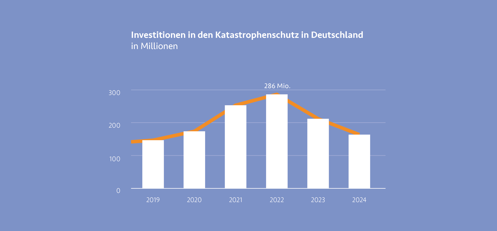

***
Der Zivil- und Katastrophenschutz erfüllt wichtige Aufgaben zur
Prävention und Bekämpfung von Großschadensereignissen in ganz
Deutschland. Für die Planung und Umsetzung entsprechender
Maßnahmen genötigt es Mittel des Bundes. Stieg der zur
Verfügung stehende Etat in den Jahren 2019 bis 2022, durch
Naturkatastrophen im Ahrtal, Fluchtbewegungen durch den
Angriffskrieg gegen die Ukraine und Implementierungen von
Warnsystemen stetig an, so ist seit 2023 ein deutlicher Rückgang
der Gelder im Bereich des Zivil- und Katastrophenschutzes zu
verzeichnen.

Im Bundeshaushalt von 2024 stehen dem von Nancy Faeser
geführten Bundesministerium des Innern und Heimat (BMI)
ein Etat in Höhe von 13,3 Milliarden Euro zur Verfügung. Das
sind zwar 253 Millionen Euro mehr als im Haushaltsjahr 2023,
allerdings kommen die Gelder nicht dem Zivil- und Katastrophenschutz
zu Gute. Die Ausgaben des BMI belaufen sich wie
folgt: Für Innere Sicherheit stehen mit 6,4 Milliarden Euro etwa
die Hälfte des Gesamtbudgets des Ministerium zur Verfügung.
Davon erhalten Bundespolizei und Bundeskriminalamt etwas
mehr als 3 Milliarden Euro. Durch die angespannte Sicherheitslage
im Land sollen mit den Geldern unter anderem 1000 Stellen
bei der Bundespolizei bezuschusst werden. Ein weiterer großer
Posten stellt die Migration und Situation von Geflüchteten dar.
Die Mittel, die das BMI zusammen mit dem Bundesamt für
Migration und Flüchtlinge (BAMF) verwalten, belaufen sich
auf 2,4 Milliarden Euro. Dabei stehen die Digitalisierung und
Beschleunigung der Asylverfahren und Integrationskurse für
Geflüchtete im Fokus.
Die Bereiche Gesellschaft und Sport und Digitalisierung teilen sich
eine Fördersummen in Höhe von 663 Millionen und 668 Millionen
Euro. Für die Förderung des Bevölkerungsschutzes werden insgesamt
lediglich 570 Millionen Euro beschlossen. Ein Großteil
erhält das Technische Hilfswerk und das Bundesamt für Bevölkerungsschutz
und Katastrophenhilfe. [^1]

der Etat im zweiten Jahr in Folge deutlich gekürzt. Das Budget
des BBK liegt im Haushalt 2024 bei rund 162 Millionen Euro, ein
Rückgang von fast 50 Millionen Euro zum Vorjahresetat von rund
211 Millionen Euro und ein Rückgang von ganzen 122 Millionen
zum Jahr 2022 mit Rekordsummen von knapp 286 Millionen
Euro. [^2] Die deutliche Steigerung der Mittel in den Jahren 2020
bis 2023 ist durch diverse Krisen und Notlagen wie etwa die
Flutkatastrophe im Ahrtal, Flüchtlingsströme nach dem Angriff
Russlands auf die Ukraine und Auswirkungen der Corona-Pandemie
zurückzuführen. Ein weiterer Faktor für eine zusätzliche Bezuschussung
des Katastrophenschutzes war die Aussetzung der Schuldenbremse
in den Jahren 2020 bis 2022. Somit konnten mehr Gelder
für den Katastrophenschutz bereitgestellt werden, als in den Jahren
zuvor. Nancy Faeser sprach sich positiv für die Entscheidung der
Wiedereinhaltung der Schuldenbremse im Haushalt 2023 aus. [^3]

[^4]

Doch die Kürzungen stoßen nicht nur in der Politik, sondern
auch bei Hilfsorganisationen und Verbänden auf starke Kritik.
Das THW benötige mehr Zuschüsse um die geplante Errichtung
zahlreicher neuer Unterkünfte für Ortsverbände zu stemmen
und es müssen Kürzungen bei der Warnung der Bevölkerung
vorgenommen werden. Auch der ASB äußert Kritik, da die
Finanzierung weiterer mobiler Betreuungsmodule somit nicht
gesichert sei. Doch neben Geldern fordern Hilfsorganisationen
auch Reformen, die es ermöglichen die Freistellung von Helfenden
zu erleichtern und die Einführung eines zentralen bundesweiten
Krisenmanagements um schnellere Reaktionszeiten umzusetzen. [^2]
Ähnliche Entwicklungen sind in Bayern zu sehen. Während der
Verhandlungen über den Umwelt-Etat des Freistaats Bayerns
Anfang Juni 2024 sind weite Teile des Bundeslandes überschwemmt.
Doch es wird auch hier kein zusätzliches Geld in den Hochwasserschutz
investiert, obwohl aktuell tausende Menschen mit teilweise
immensen Schäden zu kämpfen haben. Laut verhandeltem
Haushalt sehen im Jahr 2024 und 2025 rund 280 Millionen Euro
für den Hochwasserschutz zur Verfügung. Eine Erhöhung trotz
aktueller Ereignisse wurde nicht beschlossen. Kritik am Haushalt
und an der Hochwasserpolitik der Koalition aus CSU und Freien
Wählern gibt es unter anderem von Patrick Friedl: „Was muss
eigentlich noch passieren, dass Sie die Kommunen wirksam
unterstützen? Sie sind es, die die Hauptlast der Klimaschäden
tragen. Warum handeln Sie nicht in dieser Woche?“ Diesen
Aussagen schenkt die Regierung wenig Beachtung und verweist
auf die 300 gebauten Rückhaltebecken, der Renaturierungen
von Flüssen und der Rückverlagerung von 73 Deichen. Doch die
Opposition sieht noch viel Luft nach oben. So werden Projekte
oft in die länge gezogen, werden nicht rechtzeitig fertiggestellt
oder scheitern an aufwändigen Freigabeverfahren. Zwar werden
bis 2030 im Freistaat insgesamt 2 Milliarden Euro für den Hochwasserschutz
veranschlagt, die Summe stagniert allerdings. Durch steigende Baukosten und Inflation steht am Ende sogar weniger Geld zur Verfügung als noch vor einigen Jahren. [^5]

Die Bezuschussung des Bevölkerungsschutzes und die stabile
Investition durch Hilfsgelder für Projekte, Hilfsorganisationen
und der Stärkung der Resilienz der Bevölkerung sind essentiell
für einen einwandfreien Bevölkerungsschutz in Deutschland. Nur
durch langfristige Investitionen und Sicherheit in der Planung und
Umsetzung von Projekten im Bereich des Krisenmanagements
können Krisen nachhaltig und vorausschauend bekämpft und
eingedämmt werden. Die Zerstörung durch Naturkatastrophen
und deren Folgekosten sind exponentiell teurer und massiv
aufwändiger, als ein zukunftsträchtiger Bevölkerungsschutz.
Wissenschafter:innen, Forscher:innen, Hilfsorganisationen und
Betroffene appellieren schon seit Jahren an die Politik. Bisher
allerdings nur mit mäßigem Erfolg. Dabei könnte im gesamten
Bundesgebiet mit durchdachten und durchaus kostenschonenden
Mitteln eine deutlich höhere Resilienz anstreben und erreichen
werden, wären die nötigen Mittel vorhanden.

[^1]: [Vgl. Bundesministerium des Innern und für Heimat: Wir stärken die innere Sicherheit,
jetzt und in Zukunft, 2024, <i> <u> https://www.bmi.bund.de/SharedDocs/kurzmeldungen/
DE/2024/01/haushalt-bt.html]()</u></i>
[^2]: [Vgl. WDR: Kürzungen beim Katastrophenschutz – Kritik aus NRW, 2023, <i> <u> https://www1.
wdr.de/nachrichten/kuerzungen-haushalt-faeser-katastrophenschutz-100.html]()</u></i>
[^3]: [Vgl. Deutscher Bundestag: Kritik an Kürzungen im Etat von Innenministerin Nancy Faeser,
2022, <i> <u> https://www.bundestag.de/dokumente/textarchiv/2022/kw36-de-inneresheimat ]()</u></i>
[^4]: [Abb.: Investitionen in den Bevölkerungsschutz <i> <u> https://www1.wdr.de/nachrichten/kuerzungen-haushalt-bundesinnenministerin-
faeser-katastrophenschutz-100.html]()</u></i>
[^5]: [Vgl. BR: Bayerns Umwelt-Etat – Keine Erhöhung des Hochwasserschutzes, 2024, <i> <u> https://
www.br.de/nachrichten/bayern/bayerns-umwelt-etat-keine-erhoehung-hochwasserschutz]()</u></i>