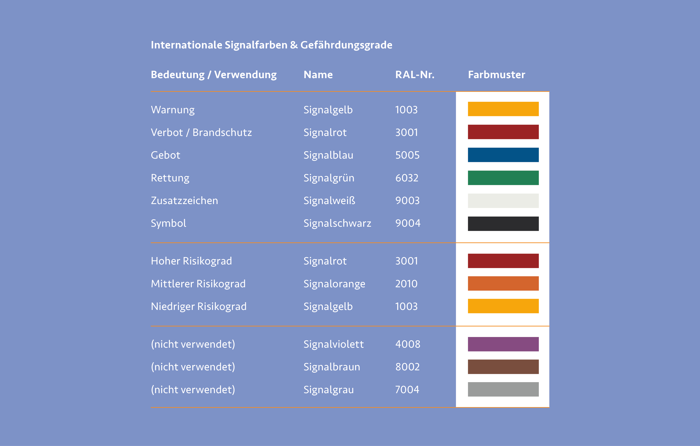
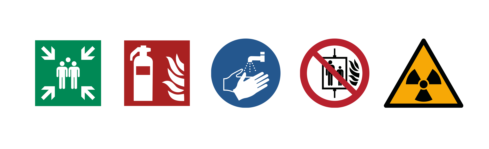
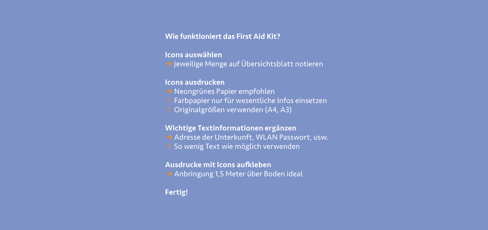
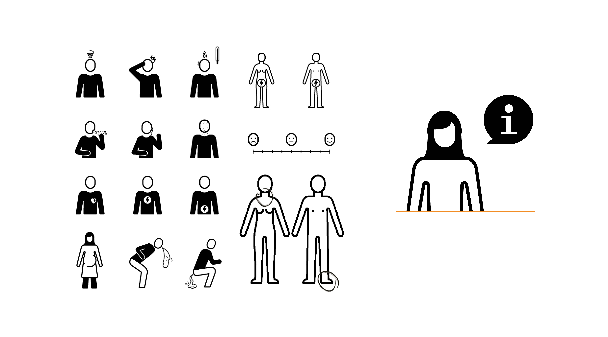
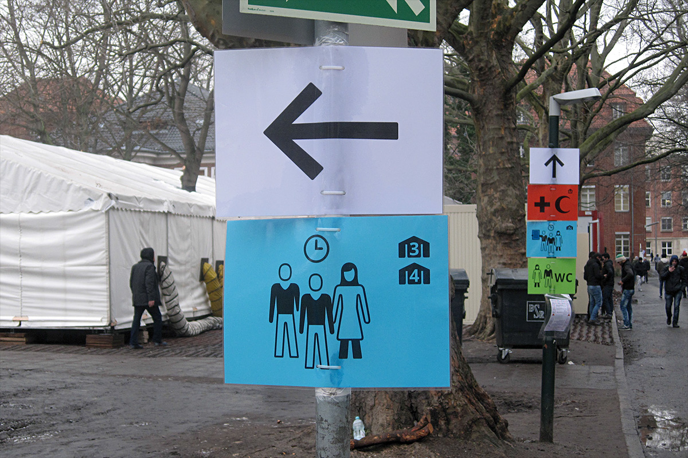
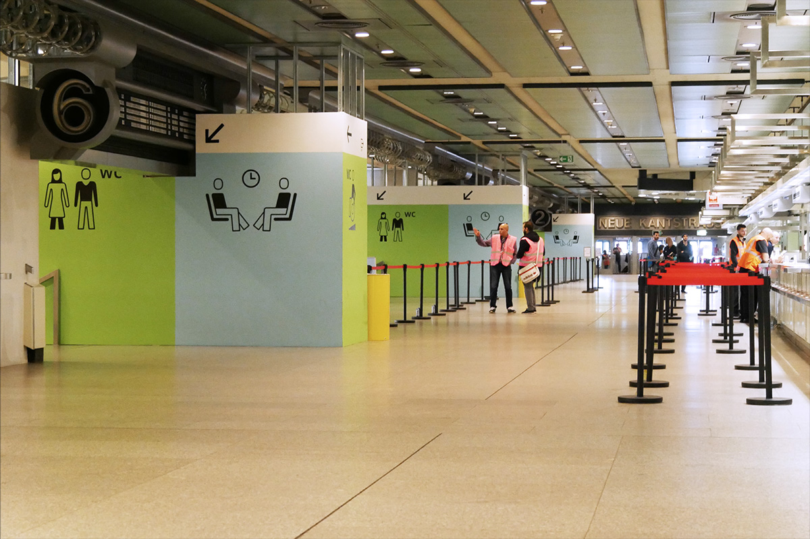

***
 
<b> Fluchtsysteme </b>

Rettungs- und Fluchtwege sind anthropozentrisch und stellen
somit den Menschen klar in den Mittelpunkt. In unserem Alltag
sind sie überall zu finden und sogar gesetzlich vorgeschrieben.
Ob in Schulen, Supermärkten, Wohnhäusern, Industrieanlagen
oder unübersichtlichen Werkstätten. eine Ausweisung der nächstgelegen
Fluchtmöglichkeit im Brand- oder Katastrophenfall ist
zwingend notwendig und kann Menschenleben retten. Um eine
einheitliche Beschilderung und eine direkte Wiedererkennung
zu gewährleisten, sind Vorschriften und Regelungen für den
Umgang der Fluchtsysteme festgeschrieben. Diese unterscheiden
sich von Land zu Land. Um allerdings auch im Ausland eine einwandfreie
Deutung zu gewährleisten, wurde eine Vereinheitlichung
von Fluchtzeichen und Symbolen in der Europäischen Union
veranlasst.

2012 legte das europäische Komitee für Normung Comité Européen
de Normalisation (CEN), mit Sitz in Brüssel, die internationale
ISO 7010 als europäische Norm für Grafische Symbole der Sicherheitszeichen
fest. Sie ersetzte in Deutschland die bis dahin
bestehende DIN-Norm 4844-2. Mit der ISO 7010 wurde der Bedarf
von einem einheitlich definierten Regelsatz von Sicherheitsinformationen
im internationalen Kontext geklärt. Davor gab
es keine übergreifenden Regeln zur einheitlichen Behandlung
und Darstellung von Rettungs-, Verbots-, Gebots-, und Brandschutzzeichen,
was bei internationalen Nutzenden zu stetiger
Missinterpretation führte. Sicherheitsinformationen werden so
ohne möglichst viele Worte oder Zusatzinformationen meist
komplett auf Symbolebene transportiert, was die internationale
Nutzung deutlich vereinfacht und vereinheitlicht. Die ISO 7010
gilt allerdings nicht für den Straßen-, Eisenbahn-, Luft- oder
Wasserverkehr, diese Bereiche werden durch eigene Sicherheitszeichen
geregelt. [^1]

Genau wie Zeichen haben auch Farben und Formen Sicherheitsaufgaben.
Mit der Normreihe ISO 3864 werden diese international
geregelt. In der ISO 3864-4 sind Signalfarben festgelegt, welche
unterschiedliche Aufgaben erfüllen. Die wohl gängigste und
verbreitetste der Signalfarben ist das Signalrot welches für
Brandschutz und Verbote eingesetzt wird. Außerdem werden mit
den Farben Signalrot, Signalorange und Signalgelb besondere
Risikograde hervorgehoben, die Gefahren, Warnungen oder Vorsicht
signalisieren. Außerdem gibt es noch weitere Signalfarben
der RAL Classic, die für keine offiziellen Aufgaben oder Bereiche
zuständig sind. Diese sind Signalviolett, Signalgrau und Signalbraun.
RAL-Farben sind genormte, weltweit anerkannte Farben
vom Deutschen Institut für Gütersicherung und Kennzeichnung. [^2]

[^3]

Bei der ISO 7010 wird unter folgenden Sicherheitszeichen
unterschieden: Rettungszeichen (E), Branschutzzeichen (F),
Gebotszeichen (M), Verbotszeichen (P) und Warnzeichen (W).

**Rettungszeichen** sind rechteckig, meist mit einem Richtungspfeil
versehen, ihnen ist die Signalfarbe grün zugeordnet und sie tragen
ein weißes Piktogramm. Durch sie werden Einrichtungen zur
Rettung oder Fluchtwege kommuniziert.

**Brandschutzzeichen** sind quadratisch und stehen mit weißen
Piktogrammen auf rotem Grund. Sie geben Aufschluss über
Einrichtungen und Geräte, die beim Brandschutz von Bedeutung
sind.

**Gebotszeichen** sind rund und verfügen über ein weißes Piktogramm
auf blauem Grund. Bei ihnen handelt es sich um Aufforderungen,
die der Sicherheit der Nutzenden dienen.

**Verbotszeichen** sind ebenfalls rund und haben ein schwarzes
Piktogramm auf weißem Grund. Der rote Balken, der das Zeichen
durchquert, zeigt das Verbot einer jeweiligen Handlung.

**Warnzeichen** werden durch ein Dreieck abgebildet. Die Signalfarbe
gelb bildet dabei den Hintergrund und das Zeichen wird
durch ein schwarzes Piktogramm komplettiert. Es weist auf eine
potenzielle Gefahrenstelle hin. [^1]

**Brandschutzzeichen** und Rettungszeichen müssen laut der
Technischen Regeln für Arbeitsstätten A1.3 langnachleuchtend
sein. Auch ohne Zufuhr von Energie müssen sie nach Anregung
durch Lichtquellen in der Dunkelheit selbständig Leuten, um
die Bedeutung des Schildkörpers zu übermitteln. Dabei verliert
das Zeichen seine Farbigkeit, behält allerdings das eindeutige
visuelle Symbol als Identifizierung.

[^4]

Hier zeigt sich der universelle Einsatz von Farben, Piktogrammen
und Zeichen als gelungene Schnittstelle, für die internationale
Verständigung in Notsituationen. Durch die einheitlichen Vorgaben
und Gestaltungsregeln können sich auch Betroffene aus
anderen Ländern in Notfallsituationen in einer für sie ungewohnten
Umgebung zurechtfinden, ohne in kürzester Zeit ein neues
System erlernen zu müssen. Der Einsatz von Formsprache und
Farbwahl orientiert sich an erlernten Mustern wie etwa des
Straßenverkehrs – Warnzeichen sind dreieckig, Verbotzzeichen
sind rund und mit einem roten Balken durchgestrichen. Diese
Taktik hilf zusätzlich die jeweiligen Zeichen deuten und klar verstehen
zu können. Gerade in stressigen und unübersichtlichen
Situationen benötigen wir Halt und Struktur um uns in unvertrauten
Umgebungen zurechtzufinden.

<b> First Aid Kit </b>

<i><b>

„Welche Zeichen können wir setzen, um
Flüchtenden Respekt entgegen zu bringen?
Ein sprachunabhängig verständliches,
iconbasiertes Kommunikationssystem
für Erstunterkünfte zeigt die wichtigsten
Infos deutlich und geht auf ethnische
Eigenheiten subtil, aber effizient ein.“ [^5]

</i></b>

Ein Positivbeispiel für ein gelungenes Leit- und Informationssystem
stellt das „First Aid Kit“ der österreichischen Gestaltungsagentur
buero bauer dar. Im Zuge der Flüchtlingsströme 2015
entwickelte die Agentur ein iconbasiertes Kommunikationssystem,
das Geflüchteten die Ankunft und Orientierung in den für sie
unvertrauten Geflüchtetenunterkünften erleichtern sollte. Sind
Geflüchtete endlich in einem sicheren Land angekommen, sind
sie fremde, beherrschen die Sprache nicht, befinden sich in einer
fremden Kultur und es fehlt an verständlichen Informationen und
Orientierung für die Betroffenen.

Mit der Frage, wie Gestalter:innen konkret zur Verbesserung der
Lage in Geflüchtetenunterkünften beitragen können, wandte sich
buero bauer an eine Anlaufstelle für Geflüchtete in Wien Mitte.
Dort wurde schnell klar, dass ein großer Bedarf an strukturierter
Erstinformation benötigt wurde. Durch die vorhandene Flut
an Zetteln und Regeln an Türen und Wänden des Gebäudes in
verschiedenen Sprachen und die Tatsache der teilweise widersprüchlichen
Informationen, herrschte Verwirrung und Angst
unter den Geflüchteten. Die wenigen Helferinnen und Helfer
vor Ort waren oft damit beschäftigt, die Informationen zu
übersetzen und Strukturen der Unterkunft zu erklären, anstatt
die benötigte Hilfe zu leisten.

Die Idee war klar – ein iconbasiertes Informationssystem, welches
die Orientierung der Geflüchteten erleichtert und essentielle
Informationen über Versorgung, medizinische Hilfe und Verwaltungsfragen
bereitstellen soll. Außerdem soll das System so
kostengünstig und Anpassungsfähig wie möglich sein, um im
besten Fall standortunabhängig zu funktionieren.

In unserem westlichen Kulturkreis haben wir bestimmte Symbole
und Darstellungen direkt mit Institutionen oder Handlungen
verknüpft. So steht bei uns ein rotes Kreuz auf weißem Hintergrund
für erste Hilfe, doch in arabischen Ländern steht der rote
Halbmond für ärztliche Versorgung. Auch die Darstellung von
Personen kann sich durch kulturelle und religiöse Unterschiede
differenzieren. So tragen Frauen in arabischen Kulturen häufig
ein Kopftuch, in europäischen Ländern wird dies weniger aus
religiösen Gründen getan und die Piktogramme sind dementsprechend
unterschiedlich. Diese Gegensätze zu kombinieren
ist eine durchaus knifflige Angelegenheit, die in diesem Projekt
mit sehr viel Liebe und Feingefühl umgesetzt wurde. Demnach
verfügen weibliche Abbildungen über eine Kombination aus
Kopftuch und Haaren, die je nach Deutung beide Komponenten
erfüllen. Auch die Darstellung der Körperform wurde so gewählt,
dass die Figur direkt als weiblich gelesen werden kann und
gleichzeitig ein Rock oder einen Umhang trägt, um kulturelle
Unterschiede besser ansprechen zu können. Durch durchdachte
Gestaltungsarbeit konnte so ein Pool an Piktogrammen entwickelt
werden, die für die unzähligen Bereiche einer Geflüchtetenunterkunft
benötigt werden. Von Erstinformationen wie Adresse,
WLAN, Sanitärbereiche und Trinkwasser bis hin zu spezifischeren
Anlaufstellen wie der Abfallentsorgung, medizinische Stellen,
Spielplätze für Kinder oder Regelungen innerhalb der Unterkunft
ist alles dabei. Durch die einheitliche Darstellung und klaren Linien
können Geflüchtete die Informationen klarer wahrnehmen und
wissen genau, welche Elemente für die Orientierung und welche
für Empfehlungen vorgesehen sind. [^6]

Eine weitere Besonderheit sorgt für eine kostengünstige und
schnelle Bespielung von Flächen und Unterkünften. Die Piktogramme
und Servicehinweise können einfach auf handelsübliche
DIN-A4 Papiere vor Ort gedruckt werden. So passen sie sich der
jeweiligen Unterkunft genau an und können je nach Bedarf erweitert
oder umgehängt werden. Des weiteren sorgt die Vorgabe,
die Piktogramme auf grünem Neonpapier zu drucken für eine
klare Unterscheidung zu anderen Informationen und ist somit
auch aus weiterer Entfernung zu identifizieren und sorgt für
mehr Aufmerksamkeit und Identifikation. Buero bauer stellt
zudem das gesamte Informationssystem als Open Source zum
download bereit, damit möglichst vielen Unterkünften und
Geflüchteten damit geholfen werden kann. [^7] Das System wird
durch weitere Piktogramme und Hinweisen stetig erweitert.

Das First Aid Kit ist einfach, klar verständlich und universell einsetzbar.
Außerdem kann es ohne großen Aufwand und durch
niedrige Kosten an unterschiedlichen Standorten implementiert
werden und ist durch seine prägnante Farbe direkt zu erkennen.
[^6] Außerdem gibt es dem Thema der kulturellen Unterschiede
einen neuen Denkanstoß und trägt zur besseren Verständigung
untereinander bei. Mit diesem Projekt wurde gezeigt welchen
Einfluss Design und Gestaltung auf die Wahrnehmung und
interkulturelle Verständigung haben können und mit welch
einfachen Mitteln eine gelungene Lösung erzielt werden kann.

**2016 wurde das Projekt bei den European Design Awards mit dem 2. Platz in der Kategorie „Self-Initiated Projekts“ ausgezeichnet.** [^8]

[^9]
[^9]
[^9]

 
<b> LAGeSo – ICC Berlin </b>

Das vorangegangene Projekt der österreichischen Agentur buero
bauer hatte zugleich großen Einfluss auf das Wegeleitsystem vor
dem Landesamt für Gesundheit und Soziales (LAGeSo) in Berlin.
In der dortigen Geflüchtetenunterkunft fehlte es an visueller
Kommunikation und so schlossen sich Lilli Artmann, Helferin
für Geflüchtete, Anna Gaißmaier, Expertin für Wegeleitsysteme
und Fritz Grögel, Designer, zusammen und erarbeiteten ein
Leit- und Informationssystem. Als Grundlage diente dabei das
öffentlich zugängliche System First Aid Kit. Das System wurde
durch einige Grundbausteine erweitert und an eine Nutzung für
Außenflächen angepasst. Durch die farbliche Trennung der drei
Hauptbereiche Medizin, Versorgung und Verwaltung wurde eine
Codierung geschaffen, die es den Nutzer:innen ermöglicht, sich
sicher über das Gelände bis hin zum jeweiligen Ziel zu navigieren.
Das System wurde gut von den Geflüchteten angenommen und
so konnte das Designteam ihr erarbeitetes System auf andere
Standorte wie etwa der Geflüchtetenunterkunft am ICC Berlin
mit täglich bis zu 1400 Neuankömmlingen ausweiten. Bei der
Kommunikation von Informationen und Inhalten wurde zum
Großteil auf visuelle Anreize und Piktogramme gesetzt, was
die universelle Verständigkeit erhöhte. Somit konnten viele
Helfer:innen vor Ort entlastet und einige Angelegenheiten,
die keine direkte Betreuung erforderten von den Geflüchteten
selbst durchgeführt werden.

Für Informationen, die eine sprachliche Komponente enthielten,
wurden sechs Leitsprachen festgelegt, darunter deutsch, englisch,
arabisch und russisch. Noto Sans wurde als Schrift gewählt, da
sie über Google kostenlos zur Verfügung steht und alle nötigen
Schriftsysteme der verwendeten Sprachen abdeckt. Als visuelle
Landmarks dienten großflächige Kennzeichnungen auf Rigipsplatten,
die sich als Begrenzung ohnehin im Gebäude befanden.
Weitere Elemente waren Banner, Aufstellen und Kleinschilder,
die durch Farbcodierung und die jeweiligen Piktogramme die
Orientierung und Wegbereitung in den teilweise unübersichtlichen
Gebäuden und Messehallen erleichterten.
Durch die schnelle Beauftragung und Umsetzung des Projektes,
konnte zeitnah ein funktionales und klares Orientierungskonzept
erarbeitet werden, das viele Geflüchteten sicher und präzise an
ihre jeweiligen Anlaufstellen geführt hat. [^10]

Auch hier zeigt sich ein erneutes Positivbeispiel durch den Einsatz
von Gestaltung bei der schnellen Umsetzung von Orientierungsmaßnahmen.
Die schnelle Anpassungsfähigkeit der Elemente und
der durchdachte Einsatz von Farben und Piktogrammen, erwiesen
sich auch hier als mächtiges Mittel zur Problemlösung durch
Gestaltung.

[^11]
[^11]

[^1]: [Vgl. ISO7010.de: DIN EN ISO 7010, 2024, <i> <u> http://www.iso7010.de/iso-7010/ ]()</u></i>
[^2]: [Vgl. Wikipedia: ISO 7010, 2024, <i> <u> https://de.wikipedia.org/wiki/ISO_7010]()</u></i>
[^3]: [Abb.: Signal- und Warnfarben <i> <u> https://de.wikipedia.org/wiki/ISO_7010]()</u></i>
[^4]: [Abb.: Unterschiedliche Zeichen <i> <u> https://de.wikipedia.org/wiki/ISO_7010]()</u></i>
[^5]: [Zitat: buero bauer: First Aid Kit, Opensource Infotool, Wien, 2015, <i> <u> https://buerobauer.com/projekte/first-aid-kit/]()</u></i>
[^6]: [Vgl. changeX: Erste Orientierung im fremden Land, 2015, <i> <u> https://www.changex.de/Article/ideen_fuer_gefluechtete_first_aid_kit]()</u></i>
[^7]: [Vgl. buero bauer: First Aid Kit – Opensource Infotool, 2015, <i> <u> https://buerobauer.com/projekte/first-aid-kit/]()</u></i>
[^8]: [Vgl. EDAWARDS European Design: First Aid Kit for Refugees & NGOs, 2016, <i> <u> https://awards.europeandesign.org/winner/176669]()</u></i>
[^9]: [Abb.: First Aid Kit <i> <u> https://buerobauer.com/projekte/first-aid-kit/]()</u></i>
[^10]: [Vgl. Grögel, Fritz: Wegeleitsystem LAGeSo, 2016, <i> <u> https://www.fritzgroegel.net/wp/wegeleitsystem-lageso/]()</u></i>
[^11]: [Abb.: LAGeSo Leitsystem <i> <u> https://www.fritzgroegel.net/wp/wegeleitsystemlageso/]()</u></i>