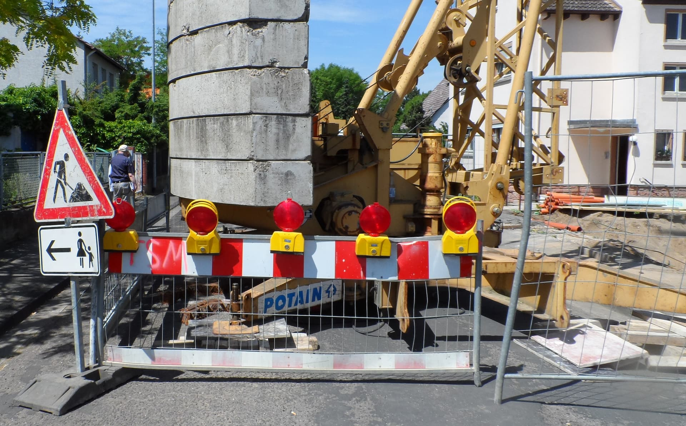
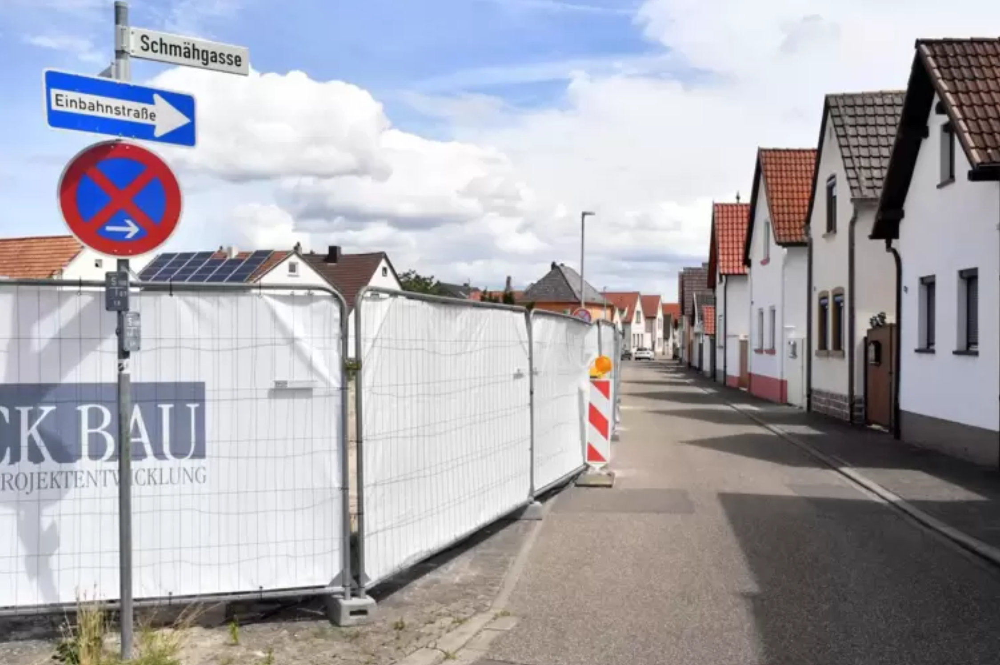
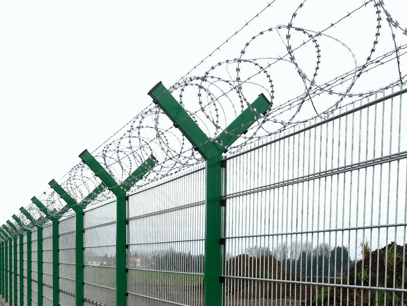
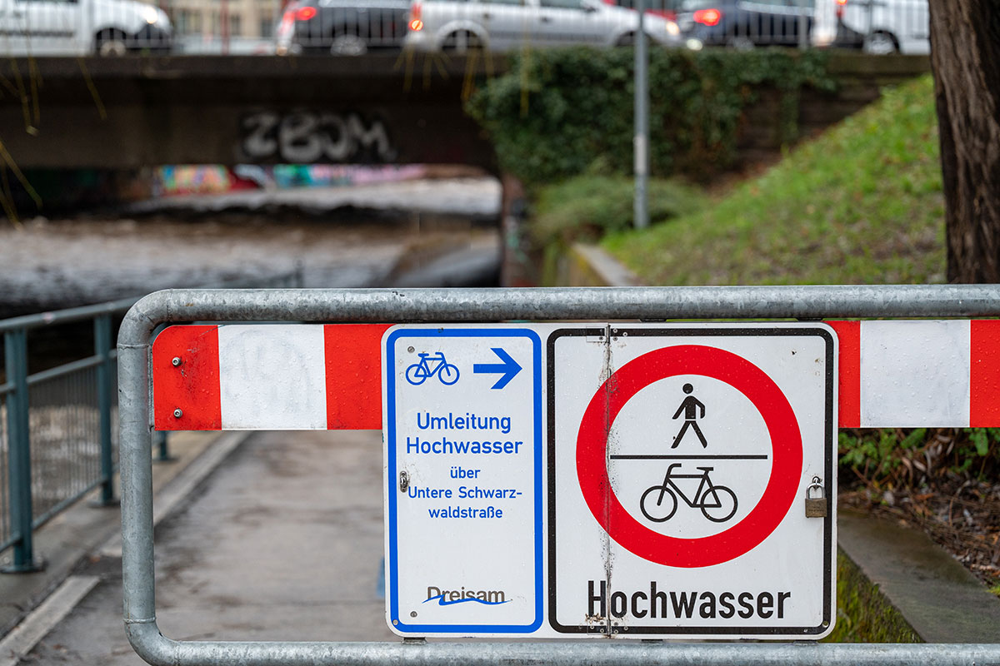

***
Nähert man sich einer Gefahrenstelle, ist eine Absperrung
meist der erste visuelle Hinweis, welchen man wahrnimmt. Sie
signalisieren Gefahren, ob temporär oder längerfristig. Straßensperrungen
begegnen uns in vielen alltäglichen Situationen,
indes auch zu besonderen Anlässen. Doch wie unterscheiden
sich die einzelnen Arten voneinander und welche Besonderheiten
weisen Sperrungen in Krisengebieten und bei Naturkatastrophen auf?

<b> Baustellensicherung </b>

Eine der gängigsten Absperrungen sind wohl bei Baustellen zu
finden. Diese begegnen uns täglich im Stadtraum und dienen der
Absicherung der Baustelle von inneren und äußeren Gefahren.
In dieser Analyse beschränken wir uns auf die äußere Baustellensicherung.
Hierzu gibt die Bundesanstalt für Arbeitsschutz und
Arbeitsmedizin genaue Vorgaben. Um Personen vor den Gefahren
einer Baustelle zu schützen, ist eine Errichtung eines Bauzauns
erforderlich. Dieser stellt eine räumliche und optische Abgrenzung
des Gebietes dar und hält Unbefugte vom betreten der Gefahrenbereiche
ab. Bauzäune können blickdicht durch Holz oder lichtdurchlässig
durch Drahtgitter errichtet werden.

Um die Trennung der Baustelle optisch für Verkehrsteilnehmende
hervorzuheben, ist die Sicherung durch zusätzliche Mittel erforderlich.
Es sind Maßnahmen an Straßen-, Rad- und Gehwegen vorzunehmen.
Die Sicherung kann durch zusätzliche Verkehrsschilder,
Markierungen, Lichtsignalanlagen, Baken oder Leitplanken erlangt
werden. Diese sichern die Baustelle über ihren gesamten Zeitraum
hinweg. [^1]

[^2]
[^3]

<b> Sicherung von Unfällen </b>

Liegen Einsatzgebiete im aktiven Verkehrsraum, sprich auf
öffentlichen Straßen mit aktivem Fahrzeugverkehr, so müssen
Warn- und Absperrmaßnahmen zum Schutz der Einsatzkräfte
unverzüglich vorgenommen werden. Alle nötigen Maßnahmen
der Absicherung von Unfallstellen sind im „Sicherheit im Feuerwehrdienst“
GUV I 8651 der deutschen gesetzlichen Unfallversicherung
zusammengefast. Eine Sicherung der Unfallstelle ist
prinzipiell Aufgabe der Polizei. Sollte diese allerdings erst nach
der Feuerwehr eintreffen oder nicht entsprechend ausgestattet
sein, ist es Aufgabe der Feuerwehr, die Unfallstelle gemäß ihres
Ausmaßes abzusperren. [^4]

Bei der Sicherung eines Unfalls muss die Höchstgeschwindigkeit
der Straße berücksichtigt werden und die Sicherung dementsprechend
angepasst werden. Hat die Straße eine direkte Gegenfahrbahn,
muss eine Absicherung gleichermaßen auf beiden
Richtungen erfolgen. Zum Absichern einer Unfall- oder Gefahrenstelle
werden unter anderem Warndreiecke, Warnleuchten,
Verkehrsleitkegel (Zeichen 610 StVO, mindestens 500 Millimeter
hoch, auf Autobahnen 750 Millimeter, vollreflektierend), Warnflaggen,
Warnschilder, Beleuchtungsgeräte und in ausgewählten
Fällen Fahrzeuge mit Warntafeln vorgesehen. Zusätzlich haben
Einsatzfahrzeuge ihr Rundum-Kernlicht, ihre Warnblinkanlage
und ihr Fahrlicht anzustellen. Einsatzkräfte haben im gesamten
Einsatz reflektierende Warnkleidung zu tragen. [^5]

[^6]

Militärische Sicherheitsbereiche
Ein militärischer Sicherheitsbereich, kurz MSB, ist ein militärischer
Bereich im Bundesgebiet und kann beispielsweise eine Kaserne
oder ein Truppenübungsplatz sein. Militärische Sicherheitsbereiche
unterscheiden sich zu normalen militärischen Bereichen in dem
Sinne, da dort besonders schutzbedürftige Gebäude mit gelagerten
Waffen oder sensibler Infrastruktur zu finden sind. Militärische
Sicherheitsbereiche unterliegen besonderen Regeln für Besucher:innen sowie Soldat:innen. Diese Bereiche können nur durch jeweilige Zugangsberechtigungen und mit Begleitung
betreten werden. Außerdem haben Sicherheitskräfte dort
erweiterte Befugnisse und sind in Extremfällen zum Schusswaffeneinsatz
befugt. [^7]

Militärische Sicherheitsbereiche sind immer mit entsprechenden
Warntafeln ausgestattet. Alle militärischen Bereiche und Standorte
der Bundeswehr werden besonders geschützt und bewacht.
Zusätzlich zu Zäunen mit oder ohne Übersteigschutz wird vielerorts
Wachpersonal und moderne Sicherheitstechnik mit Kameras,
Sensoren oder Wärmebildtechnik eingesetzt. Laut dem Dienstleister
„Sicherheit Nord“, der unter anderem für die Sicherheit
von Bundeswehrliegenschaften verantwortlich ist, durchläuft
das Wachpersonal Schusswaffentrainings und arbeitet mit
Diensthunden zur gründlichen und effizienten Gewährleistung
des Wachschutzes. [^8]

[^9]

<b> Absperrung in Krisengebieten </b>

Die Maßnahmen zur Sperrung von Straßen unterscheidet sich
nur marginal von der bei Naturkatastrophen wie etwa einem
Hochwasser. Wird eine Straße für Autofahrer:innen oder Fußgänger:
innen auf Grund einer Überschwemmung der Fahrbahn
gesperrt, werden Baken, Lichtsignale und „Durchfahrt Verboten“-
Schilder genutzt. Zusätzlich werden Schildkörper mit der Aufschrift
„Hochwasser“ angebracht. Eine temporäre Absperrung
mit Absperrband wird teilweise auch praktiziert. Visuell sind die
Sperrungen kaum von regulären Baustellen oder Straßensperrungen
zu erkennen. Einige Städte verfügen an Promenaden oder
Gehwegen am Flussufer über stationäre Tore oder Absperrungen,
die im Gefahrenfall einer Überschwemmung ausgefahren oder
ausgeklappt werden können. Auch eine Warnung über lebensgefährliche
Überquerungen der unter Wasser stehenden Straßen
gibt es vielerorts nicht. Immer wieder kommt es zu Meldungen,
in denen Autofahrer:innen mit ihren Autos in vollgelaufenen
Unterführungen oder Straßen feststecken. Durch Nichtbeachtung
der Absperrungen oder Fehlinterpretation der Lage sind die
betroffenen Personen dann auf Hilfe von außen angewiesen.
Durch den immensen Druck des Wassers von außen, lassen
sich die Türen der Fahrzeuge oftmals nicht mehr öffnen und die
Feuerwehr oder das THW muss alarmiert werden. Durch eine
leichtsinnige Aktion wird somit das eigene, aber auch das Leben
der Rettungskräfte aufs Spiel gesetzt. Vielen sind die Gefahren von
Wasser und Strömung nicht bewusst, wie ein kleiner Ausschnitt
aus unzähligen Beispielen zeigt.

2013 fährt eine Fahrradfahrerin an der wegen Hochwasser gesperrten
Absperrung einer Landstraße vorbei, verliert wenig später das
Gleichgewicht und wird von den Wassermassen mitgerissen
und stirbt, wie mehrere Augenzeugen berichten. Rettungskräfte
sind entsetzt und appellieren an die Menschen die Sicherheitsmaßnahmen
erst zu nehmen. „Das ist die Überschätzung der
eigenen Möglichkeiten oder der Fähigkeiten des Autos“. So
Richard van Hazebrouck vom THW Bonn. [^10]

Auch bei den Überschwemmungen im Juni 2024 in Bayern ist ein
Todesopfer durch fahrlässige Nichtachtung der Absperrung zu
beklagen. Eine Frau ignorierte eine Absperrung im überfluteten
Markt Rettenbach und fuhr mit dem Auto in die Strömung. Das
Auto lief voll Wasser und Rettungskräfte konnten sie nur noch
tot bergen. [^11]

Im selben Zeitraum kommt es mehrfach zu gefährlichen Situationen
in München. Mehrere Menschen nutzten das Hochwasser
der Isa um dort in den Strömungen zu surfen. Polizei und Feuerwehr
warnen ausdrücklich vor Nichtachtung der Absperrungen
und nannten das Verhalten der Personen unverantwortlich. So
würden nicht nur sich sondern auch Passanten und Rettungskräfte
in Lebensgefahr bringen. Es sei ein „verrücktes Risiko“, das nicht
kalkulierbar ist. Nicht nur die starke Strömung und der hohe
Wasserstand, sondern auch ankommendes Treibgut machen die
Aktion lebensmüde, so die Einsatzkräfte. [^12]

Dies war nur ein kleiner Einblick in die Gefahren der Missachtung
von Absperrungen. Nichtsdestotrotz werden Straßensperrungen
häufig missachtet und die Gefahren unterschätzt.

[^13]

<b> Absperr-Warnband </b>

An Orten wie Baustellen, Veranstaltungen, öffentlichen Plätzen
oder anderen Gefahrenstellen, die von Personen nicht betreten
werden sollen, da eine bestimmte Gefahr gesteht, ist eine Abgrenzung
und Absperrung nötig. Eine gerade bei spontanen
Schadenereignissen visuell überzeugende Möglichkeit, bietet
Absperrband, oder auch Flatterband genannt. Es kann leicht
an vorhandene Strukturen angebracht werden und grenzt bestimmte
Bereiche ab oder ermöglicht die Führung von Personen
durch einen bestimmten Bereich. Dabei unterscheidet man
zwischen mehreren Varianten des Bandes. [^14]

<b> weiß/rot </b>

Das abwechselnd weiß und rot bedruckte Kunststoffband ist das
Standardband in Deutschland. Es eignet sich für Absperrungen
bei Tageslicht und ist durch seine auffallende Farbe gut von Weitem
sichtbar. Das Band besticht durch seine Reißfestigkeit,
Wasser- und Witterungsbeständigkeit. Es kommt in vielen
Bereichen wie etwa der Absperrung von Gefahrenstellen,
Zutrittsbeschränkungen, Kennzeichnungen oder Leitung für
Besucher:innen zum Einsatz. Es wird von Polizei und Rettungskräften
benutzt, kann aber auch von Firmen und Privatpersonen
zur Gefahrenkennzeichnung eingesetzt werden.

<b> gelb/schwarz </b>

Das gelb-schwarz gestreifte Absperrband hat die gleichen
Eigenschaften wie das Standardmodell. So wird der Einsatz
allerdings laut der Arbeitsstättenrichtlinie A1.3 für ständige
Hindernisse und Gefahrenstellen eingesetzt. Dabei besteht
die Aufgabe im Anzeigen von Gefahren an Maschinen, spitzen
Kanten, Unebenheiten oder Stufen auf dem Boden, die eine
anhaltende Gefahr darstellen. Haupteinsatzbereiche sind somit
hauptsächlich Werkstätten, Lager oder Produktionsbereiche.

<b> weiß/grün </b>

Das weiß-grüne Absperrband hat keinen Eintrag in den Arbeitsstättenrichtlinien.
Es konnte sich dennoch bewähren und kann
durch seine auffällige Farbe vor Gefahrenstellen warnen und
eine gute Aufmerksamkeit auf sich ziehen, da es in der Regel
nicht häufig Verwendung findet und somit einen neuen Impuls
für das Auge bietet.

<b> weiß/blau </b>

Neben dem standardmäßigen Absperrband setzt die Polizei, seit
der Einführung der blauen Außendarstellung und Dienstkleidung,
auch auf weiß-blau gestreiftes Absperrband. Auch das Technische
Hilfswerk nutzt bei Einsätzen ein zur Außendarstellung passendes
blau gestreiftes Absperrband.

Je nach Einsatzgebiet und Akteur können auch Hinweise auf das
Band gedruckt werden. So gibt es beispielsweise Versionen für
Polizei, Feuerwehr, THW, aber auch spezifischere Hinweise wie
„Gefahr“ oder „Sperrzone“. Sie alle dienen der Gefahrenvisualisierung.
Für den Katastrophenschutz gibt es allerdings keine
einheitlichen Absperrrichtlinien oder gar eine eigene Signalfarbe.

[^1]: [Vgl. baua: Baustellensicherung, 2021, <i> <u> https://www.baua.de/DE/Themen/Arbeitsgestaltung/Arbeitsstaetten/Bauwirtschaft/Baustelleneinrichtung]()</u></i>
[^2]: [Abb.: Straßensperrung <i> <u> https://www.iagmainz.de/baustelle-absperren-sichern/]()</u></i>
[^3]: [Abb.: Bauzaun <i> <u> https://www.rheinpfalz.de/lokal/kreis-bad-duerkheim_artikel,-anwohner-bemängeln-absicherung-der-schiltchen-baustelle-_arid,5092067.html]()</u></i>
[^4]: [Vgl. Feuerwehrmagazin: Einsatzstellenabsicherung – Gefahrenquelle Verkehr, 2022, <i> <u> https://www.feuerwehrmagazin.de/wissen/einsatzstellenabsicherung-gefahrenquelleverkehr]()</u></i>
[^5]: [Vgl. Deutsche Gesetzliche Unfallversicherung: Information – Sicherheit im Feuerwehrdienst, 2011, <i> <u> https://www.unfallkasse-nrw.de/fileadmin/a-und-a/I_8651.pdf ]()</u></i>
[^6]: [Abb.: Sperrung Autobahn <i> <u> https://www.spiegel.de/reise/aktuell/sperrungen-auf-derautobahn-a7-norddeutschland-droht-stauchaos-a-1152632.html]()</u></i>
[^7]: [Vgl. Bundeswehr: Militärischer Sicherheitsbereich – was ist das eigentlich?, 2022, <i> <u> https://www.bundeswehr.de/de/aktuelles/meldungen/militaerische-sicherheitsbereichewas-ist-das-eigentlich-5529052]()</u></i>
[^8]: [Vgl. Sicherheit Nord: Bundeswehrliegenschaften – Wachschutz für die Landessicherheit, 2024, <i> <u> https://www.sicherheit-nord.de/leistungen/personelle-sicherheit/bundeswehrliegenschaften/]()</u></i>
[^9]: [Abb.: Zaun mit Übersteigschutz <i> <u> https://www.berlemann.de/produkte/zaunsysteme/sicherheitszaun/]()</u></i>
[^10]: [Vgl. Zeit Online: Gefährlicher Leichtsinn – Menschen unterschätzen Hochwasser, 2013, <i> <u> https://www.zeit.de/news/2013-06/01/wetter-gefaehrlicher-leichtsinn-menschen-unterschaetzen-hochwasser-01131002]()</u></i>
[^11]: [Vgl. Merkur: Fünfte Flut-Tote – Frau fährt durch Absperrung und stirbt im vollgelaufen Auto, 2024, <i> <u> https://www.merkur.de/bayern/fuenfte-flut-tote-frau-faehrt-durchabsperrung-und-stirbt-im-vollgelaufen-auto-bayernhochwasser-93109248.htm]()</u></i>
[^12]: [Vgl. BR: Surfen bei Hochwasser? – Absolut unverantwortlich, 2024, <i> <u> https://www.br.de/nachrichten/bayern/surfenbei-hochwasser-absolut-unverantwortlich,UEpaDkI]()</u></i>
[^13]: [Abb.: Fußgängerabsperrung <i> <u> https://www.freiburg.de/pb/411886.html]()</u></i>