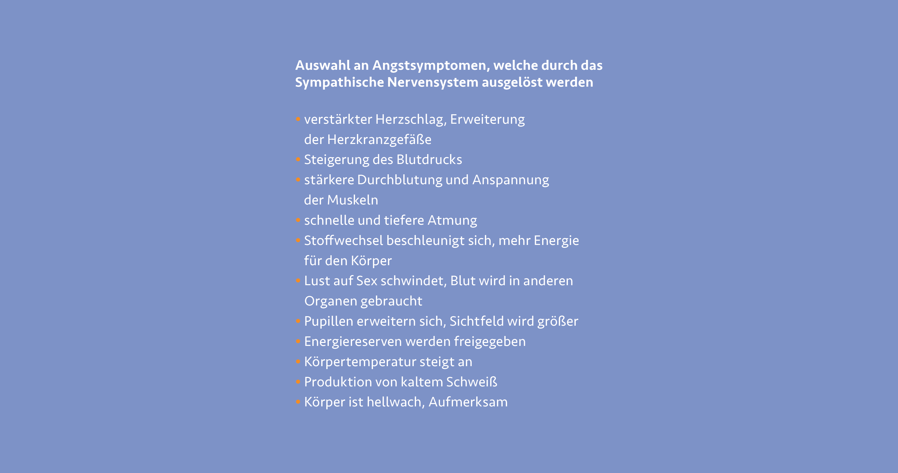

***
Um das Verhalten bei Stresssituationen besser versteht zu
können, müssen wir schauen inwiefern sich Angst auf unseren
Körper ausübt. Angst ist eine ganz natürliche Reaktion unseres
Körpers auf psychisch belastende Reaktion oder Einflüsse
unserer Umgebung. Angst schützt unseren Körper und bereitet
ihn auf mögliche Gefahren vor. Jede Situation in der wir uns
befinden, wird von den Sinnesorganen aufgenommen. Diese
leiten die Reize des Hörens, Sehens, Fühlens, Schmeckens oder
Riechens weiter an die Großhirnrinde. Diese vergleicht die Eindrücke
mit zurückliegenden, bereits erlebten Situationen und
entscheidet ob eine Gefahr besteht. Befinden wir uns in einer
solchen Situation, aktiviert das „Sympathische Nervensystem“
eine Reihe an körperlichen Vorkehrungsmaßnahmen. [^1]

[^2]

Befinden wir uns in einer unübersichtlichen, uns ungewohnten
oder fremden Situation, so sind wir oft Orientierungslos. Um
daraufhin rationale und klare Entscheidungen treffen zu können,
ist ein Prozess der Orientierung zwingend notwendig. Je nach
Umgebung kann die Suche nach Orientierung in Stress, Anspannung,
bei anhaltender Hilflosigkeit aber auch in Angstgefühle
umschlagen, so Dr. Andreas Richter in einer seiner Veröffentlichungen
zu Desorientierung und Angst aus dem Jahre 2010. [^1]
Durch den ausgeschütteten Botenstoff Noradrenalin reagiert
der Körper blitzschnell. Durch die Umgehung der Großhirnrinde
sind rationale Entscheidungen in solchen Situationen oft nicht
mehr möglich. Erstarren oder unüberlegte Entscheidungen sind
die Folge.

Auch bei den Auswirkungen von Starkwetterereignissen kommt
es oft zu Angst bei Anwohner:innen und Betroffenen. Unzählige
Berichte schildern Situationen, in denen Betroffene ihr Hab und
Gut in Sicherheit bringen wollen, obwohl das Haus schon von
Wassermassen umringt ist oder sie sich in andere Gefahrenlagen
begeben, aus denen sie sich nicht mehr selbstständig befreien
können. Befinden sie sich zudem unter Zeitdruck, im Beispiel
der Naturkatastrophen vor einer nahenden Flut oder schnell
steigender Pegelstände durch Starkregen, so sind Einflüsse von
außen um unüberlegte oder riskante Situationen zu umgehen
und Betroffene in Sicherheit zu bringen unumgänglich. Eine
klare Anweisung der Rettungskräfte, eine Warnung auf das
Smartphone oder eine eindeutige Richtungsangabe zum Evakuierungspunkt
auf einem Wegweiser geben Orientierung und
können Leben retten.

Leit- und Orientierungssysteme sind ein wichtiges Mittel, um
Überblick und Ruhe an einem bestimmten Ort zu vermitteln. Je
nach Ort und Situation erfüllen Leitsysteme unterschiedliche
Aufgaben. Wird ein Leitsystem in Kultureinrichtungen eher
als Unterstützung zum Erfahren des Geländes oder Museums
gesehen, muss es etwa in Gesundheitseinrichtungen zielgerichtet,
einfach und gerade für Menschen in Stresssituationen klar verständlich sein. Dort spielt die zeitliche Erfassung und Orientierung
eine bedeutend höhere Rolle als an anderen Orten.
Zudem muss in Einrichtungen der Gesundheitsvorsorge mit
unterschiedlichen Ausgangssituationen gerechnet werden. Vor
Ort kann der Ausfall von einzelnen Sinnen durch Unfälle oder
erfolgte Eingriffe erhöht sein und muss durch ein durchdachtes
Leitsystem aufgefangen werden. In komplexen Einrichtungen
wie Krankenhäusern ist zudem die oft über Zeit gewachsene
Infrastruktur und Verteilung der einzelnen Abteilungen auf
großen Arealen eine Herausforderung für Leit- und Orientierungssysteme.
Ist die Implementierung eines Leitsystems innerhalb
eines komplexen und unübersichtlichen Ortes gelungen, so
profitieren alle Nutzer:innengruppen davon. Service- und
Lieferpersonal finden ihren Weg aufs Gelände, Ärzte:innen und
Pflegekräften wird die Navigation vereinfacht und auch Patient:
innen, Betroffenen und Gästen wird die effektive Orientierung
und Wegeführung zum gewünschten Ziel ermöglicht. [^3]

[^1]: [Vgl. PAL Lebenshilfe: Was bei Angst im Körper passiert, 2021, <i> <u> https://www.palverlag.de/angst-koerper.html]()</u></i>
[^2]: [Abb.: Was macht Angst mit dem Körper <i> <u> https://www.palverlag.de/angst-koerper.html]()</u></i>
[^3]: [Vgl. Denker, Pia: Kriterienkatalog und Entwurfshilfe — Signaletik in Gesundheitsbauten, DOM Publishers, Auflage 1, Berlin, 2020, S. 23. <i> <u> ]()</u></i>