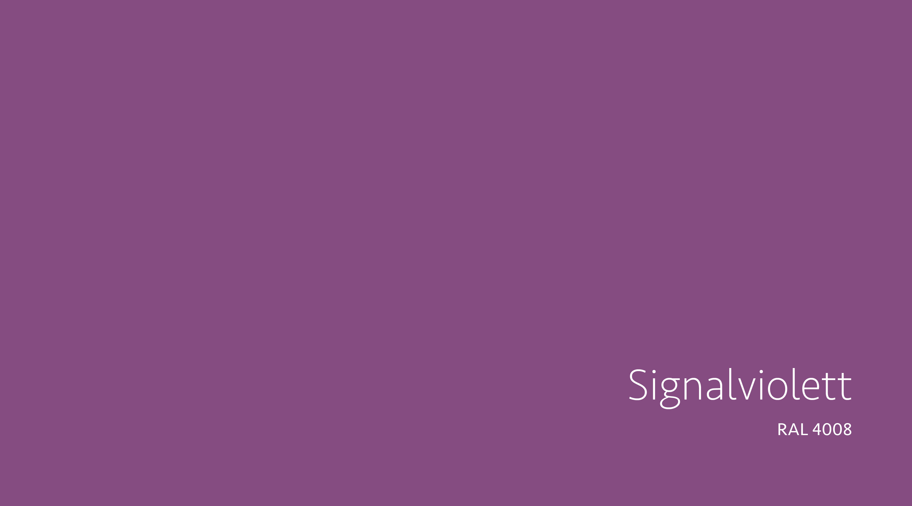
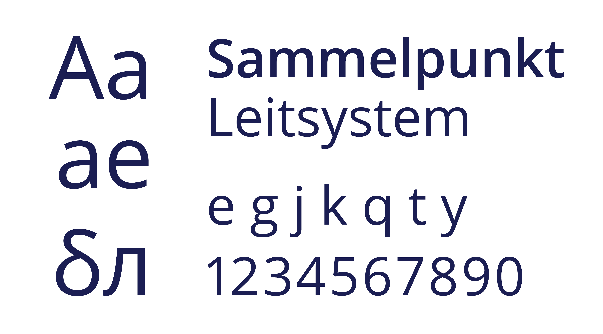
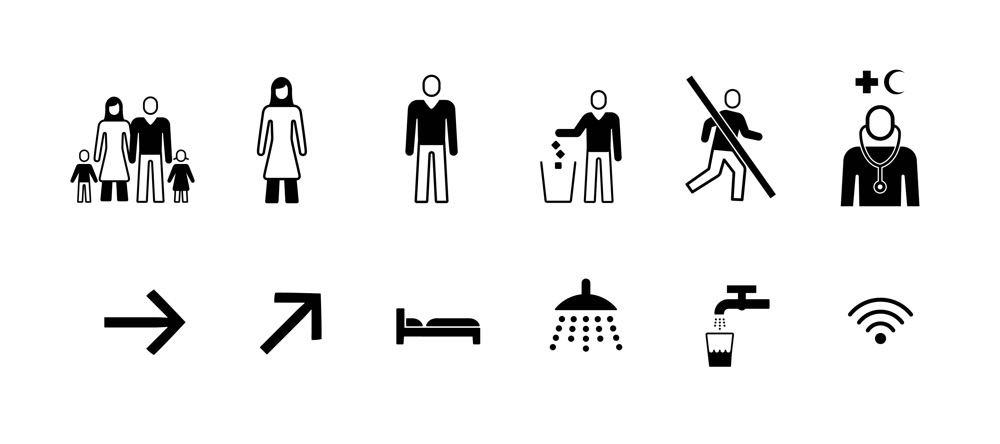
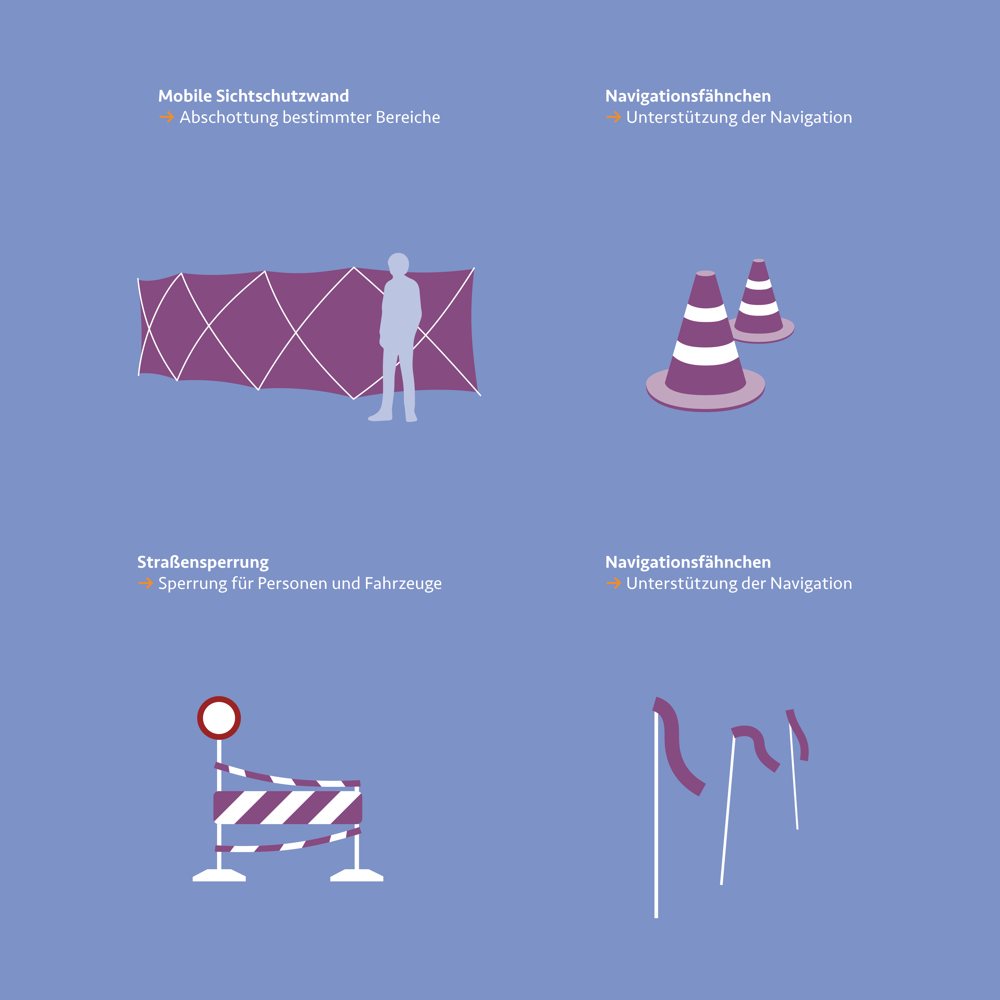

***
Um die Sichtbarkeit des Katastrophenschutzes zu stärken, können
Ansätze eines neuen visuellen Erscheinungsbildes helfen. Durch
meine vorherigen Analysen konnte ich mehrere Punkte herausarbeiten,
deren Überarbeitung und Nachbesserung zu Gunsten
der Betroffenen wären.

 
<b> Signalviolett Auszeichnungsfarbe des Katastrophenschutzes </b>

Ein immer wiederkehrender Punkt meiner Recherche ist die
Ähnlichkeit von Absperrungen und Warnhinweisen gegenüber
herkömmlichen Baumaßnahmen im Stadtraum. Um diesem
Effekt entgegenzuwirken und eine gleichwertige Sichtbarkeit
wie bei Feuerwehr oder Polizei erzielen zu können, muss eine
aussagekräftige und vor allem klar erkennbare visuelle Sprache
etabliert werden. Mein Vorschlag ist eine übergreifende, auffallende
Farbe, die von allen Akteuren des Katastrophenschutzes
genutzt wird. Signalfarben sind klar definierte Farben, die einen
möglichst hohen Signalwert erreichen. Sie eignen sich besonders
gut, um aus der Masse der umliegenden Farben hervorzustechen
und Aufmerksamkeit auf sich zu ziehen. RAL hat einige Signalfarben
ausgewiesen, die bestimmte Bereiche wie der Feuerwehr
oder Warnungsstufen zuzuschreiben sind. Diese dürfen nur von
den jeweiligen Akteuren genutzt werden, um die Farbe im Notfall
klar zu erkennen und unterscheiden zu können. Eine Signalfarbe,
der noch keine spezifische Aufgabe zugeordnet wurde, ist das
„Signalviolett“. Sie dient meinem Entwurf als visuelle Farbe des
Katastrophenschutzes. Durch ihren eigenen Farbcharakter und
ihre Einzigartigkeit sorgt sie für Aufmerksamkeit und Präsenz.
Wird das Signalviolett nun in allen Aufgabenbereichen des
Katastrophenschutzes verwendet, bildet es zusätzlich einen
gewissen Wiedererkennungswert für die Bevölkerung und
entsprechende Einsätze und Maßnahmen werden direkt mit
dem Katastrophenschutz in Verbindung gebracht. So wirkt sich
die Signalfarbe positiv auf den gesamten Bereich des Katastrophenschutzes
aus und stärkt zusätzlich die Präsenz und Wahrnehmung im Einsatz. Sind im Ernstfall Straßen und Wege durch eine uns ungewohnte und im Alltag kaum antreffende
Farbe abgesperrt oder gekennzeichnet, so kann die neue Situation
schwerer einschätzen und sind nicht so einfach gewillt, die
Absperrung zu überwinden. Durch die neue Farbe entsteht
eine ungewohnte Situation, zu der wir keine bereits durchlebte
Referenz aus unserem Alltag haben. Dies schreckt im ersten
Moment ab und hält Personen womöglich eher ab die errichteten
Barrikaden nicht zu überwinden und sich nicht in Gefahr zu
begeben.

 
<b> Eine einheitliche Typografische Ausrichtung </b> 

Schrift begegnet uns auf nahezu allen Produkten und vermittelt
auf teils subtile Art und Weise Werte und Eigenschaften eines
Unternehmen oder einer Marke. Zusätzlich unterstützt und
stärkt eine gute Schriftwahl die Charakterzüge eines Produktes.
In vielen Fällen erkennt man Unternehmen sogar nur an wenigen
Buchstaben, wenn diese ohne Zusammenhang der Marke begegnen.
Einige bekannte Beispiele dazu sind: IKEA, Coca-Cola, Disney
und Nasa. Sie prägen eine Marke maßgeblich und haben einen
großen Einfluss auf Wiedererkennung und eine positive Assoziation.

Auch der Katastrophenschutz kann von solchen positiven Konnotationen
profitieren. Zusätzlich stärkt eine einheitliche Schrift,
genau wie eine einheitliche Farbwahl, die Wahrnehmung und
Außendarstellung des Katastrophenschutzes. Die Wahl der Schrift
basiert allerdings, im Gegensatz zu Marken, nicht unbedingt nur
auf ästhetischen Eigenschaften. Vielmehr muss eine passende
Schrift für den Katastrophenschutz die hohen Ansprüche und
vielen Anforderungen der diversen Einsatzbereiche erfüllen. Sie
sollte möglichst gut lesbar sein und einen neutralen Charakter
haben. Zudem sollte sie auch für den Einsatz von interkulturellen
Texten oder Auszeichnungen vorbereitet sein. Somit würden
Einsätze während unterschiedlicher Flüchtlingsströme oder der
Hilfe im Ausland keine Probleme darstellen.

Meine Schriftwahl fiel auf die „Open Sans“. Eine serifenlose,
humanistische Font, die von Steve Matteson, einem amerikanischen
Schriftgestalter, entwickelt wurde. Sie verfügt über
insgesamt 897 einzelne Glyphen und bildet Buchstaben des gesamten
lateinischen, griechischen, hebräischen und kyrillischen
Alphabets ab. Der Charakter der Open Sans kann als neutral, aber
dennoch freundlich interpretiert werden. Seit 2021 verfügt die
Schrift außerdem über eine variable Schriftfamilie, was den
Einsatzbereich zusätzlich erweitert. Optimiert ist die Open Sans
für analoge, sowie digitale Anwendungen. [^1]

Ein weiterer Vorteil der Open Sans ist ihre kostenfreie Lizenzierung.
Dies erleichtert die Nutzung der Schrift und erweitert zugleich
den Einsatzbereich. Somit können ohne Bedenken auch Einsätze
im Ausland durchgeführt werden, ohne zusätzliche Lizenzen
erwerben zu müssen. Außerdem passt sie sich durch ihre schlichte,
freundliche Form an die unterschiedlichen Aufgabenbereiche des
Katastrophenschutzes an und vermittelt eine klare Formsprache.
Die Schrift kann unter anderem auf Hinweisschildern, Informationsmaterial,
Bannern und vielem mehr verwendet werden und sorgt zusammen mit dem aussagekräftigen Signalviolett für ein starkes, sicheres Auftreten des Katastrophenschutzes.

Weitere gute Schriften wären etwa die ebenfalls kostenlose
„Noto Sans“ und „Inter“, die ähnliche Attribute und Eigenschaften,
sowie ein umfangreiches Schriftbild aufweisen wie die Open Sans.

[^2]

 
<b> Der Einsatz von Piktogrammen im Katastrophenschutz </b>

Um Informationen schnell und einfach zu vermitteln, sind Piktogramme
unumgänglich. Sie zeigen auf einen Blick Funktion,
Tätigkeitsfelder oder Hilfsangebote an, ohne den Einsatz von
Schrift oder anderen Hilfsmitteln. Das macht sie universell
einsetzbar und auch im interkulturellen Kontext verständlich.
Piktogramme sind das ideale Mittel auch in Stress- und Krisensituationen
Informationen schnell und zielgerichtet zu vermitteln.
Egal ob auf Wegweisern, an Zelten der Notunterbringung oder
Absperrungen, sie sind universell einsetzbar und lassen die
Nutzer:innen immer erkennen wo sie sich befinden und welches
Ziel sie gerade ansteuern. Sind Piktogramme im Freizeitkontext
zu finden, etwa in Museen, Parks oder Sportanlagen, so sind sie
meist der jeweiligen Umgebung angepasst. Auch sie können den
Charakter eines Ortes wiedergeben und stärken, aber auch neue
Impulse setzen und das Gemeinschaftsgefühl stärken. Dies erreicht
man, in dem man eine möglichst breite Nutzer:innenschaft anspricht,
etwa durch Miteinbeziehen der kulturellen Eigenschaften
der anzutreffenden Besucher:innen. Auch im Katastrophenschutz,
beispielsweise bei der Bewältigung von Flüchtlingsströmen
können Piktogramme genutzt werden, die auf die Bedürfnisse
der einzelnen Personen eingehen. Das „First Aid Kit“ des, in den
vorherigen Kapiteln bereits vorgestellte, österreichischen Gestaltungsbüros
„buero bauer“ hat unter anderem eine auf die
Flüchtlingskrise zugeschnittene Piktogrammfamilie entwickelt,
die sich mit der differenzierten Darstellung von Geflüchteten
auseinandersetzt. So tragen viele Geflüchtete aus dem islamischen
Kontext Kopftücher, die bei westlichen Piktogrammen
noch keinen großen Stellenwert einnehmen. Buero bauer
konnte die Piktogramme so anpassen, dass die Darstellung
einer Frau mit Kopftuch gleichzeitig auch als eine Darstellung
einer Frau mit langen Haaren dienen kann. Somit werden weniger
Personen bei der Ansprache durch Piktogramme ausgeschlossen,
ohne eine Masse an unterschiedlichen Symbolen verwenden
zu müssen. Auch bei weiteren Darstellungen wie der Ersten
Hilfe, die bei uns klar mit einem Kreuz assoziiert ist, wird sie
in islamischen Ländern mit dessen Pendant, dem islamischen
Halbmond verbunden, was durchaus zu Irritationen bei einer Beschilderung führen kann. Die Begutachtung solcher Unterschiede kann, gerade im Kontext der Verständlichkeit und Interpretation, starke Vorteile bringen und die Orientierung für Geflüchtete
deutlich erleichtern.

Die Anwendungsbereiche im Katastrophenschutz sind sehr divers
und breit gestreut, was die Verwendung von bereits entwickelten
Piktogrammen erschwert, da die sie oft stark situationsbedingten
Symbole nicht akkurat abbilden können. Nichtsdestotrotz kann
eine Piktogrammfamilie wie die des First Aid Kit als Grundlage
dienen, um weitere spezifischere Piktogramme zu entwickeln.
Die Erarbeitung neuer Piktogramme kann aufwändig und je nach
Menge auch teuer sein, trotzdem lohnt sich meiner Einschätzung
nach eine Erstellung einer solchen umfangreichen Piktogrammkatalog.
Diese kann die Arbeit der Einsatzkräfte des Katastrophenschutzes
deutlich erleichtern und gleichzeitig für bessere
Orientierung und Verständigung sorgen. Dabei steht die neutrale
und klare Gestaltung der Piktogramme im Vordergrund, nur so
können die unterstützenden Ziele kompromisslos erreicht werden.

In den folgenden Darstellungen werde ich zur besseren Visualisierung
meines Erscheinungsbildes auf die Piktogramme des
First Aid Kit zurückgreifen, die zur kostenlosen Nutzung zur
Verfügung stehen. Eine professionell gestaltete Piktogrammfamilie
bedarf viel Fingerspitzengefühl, Arbeit und vor allem
detaillierte Absprachen mit Beteiligten. Eine etwaige spätere
Umsetzung muss mit den Akteuren und dem Gestaltungsteam
in einem andauernden Prozess detailliert begleitet werden.

[^3]

 
<b> Weitere Gestaltungsmittel </b>

Um die Neuausrichtung des Katastrophenschutzes und dessen
Wiedererkennungswert weiter zu stärken, können zusätzliche
Maßnahmen ergriffen und weitere Gestaltungsmaßnahmen
umgesetzt werden. Hier ein paar Beispiele, die durchaus einen
positiven Einfluss auf die Sichtbarkeit und die Verbesserung im
Katastrophenschutz haben können.

Bei meiner Recherche wurde ich häufiger auf die Tatsache aufmerksam,
dass viele Personen Absperrungen und Verbotszeichen
überwinden und missachten und sich so schnell in Gefahr begeben.
Ein Mittel, dies zu verhindern ist die Neuausrichtung des Katastrophenschutzes
mit der Farbe Signalviolett. Eine weitere, zusätzliche
Unterstützung könnte die Einführung sogenannter mobiler
Sichtschutzwände sein. Diese könnten Straßen, Bereiche und
Plätze vor neugierigen Blicken Schaulustiger schützen und grenzen
Gefahren auch visuell von sicheren Orten ab. Durch die blickdichte
Ausführung könnten Personen daran gehindert werden,
die Situation hinter den Absperrungen falsch einzuschätzen und
die Barrikade zu überwinden. Außerdem sind die in Signalviolett
gestalteten mobilen Wände ein deutliches Zeichen der Einsatzkräfte
und symbolisieren Sicherheit und Präsenz des Katastrophenschutzes
vor Ort. Dennoch wären Zufahrten für Einsatzkräfte
mit Fahrzeugen und Räumungsgerät möglich, da die mobilen
Sichtschutzwänden ohne großen Aufwand abgebaut oder neu
positioniert werden könnten.

Weitere nützliche Hilfsmittel sind Navigationsfähnchen. Diese
können durch ihren einfachen Aufbau blitzschnell aufgestellt
und installiert werden. Am Ende ihres Stabes ist ein kleines
Fähnchen platziert, das durch das Flattern und das auffällige
Signalviolett den sicheren Weg weisen kann. Sie dienen als
Orientierungspunkte zwischen zwei Wegweisern und bei Hochwasser
einen sicheren Weg markieren.

[^1]: [Vgl. Google Fonts: Open Sans, 2024, <i> <u> https://fonts.google.com/specimen/
Open+Sans?preview.text=Die%20Erste%20Hilfe%20befindet%20sich%20im%20
Zelt.&stroke=Sans+Serif]()</u></i>
[^2]: [Google Fonts: Open Sans, 2024, <i> <u> https://fonts.google.com/specimen/
Open+Sans?preview.text=Die%20Erste%20Hilfe%20befindet%20sich%20im%20
Zelt.&stroke=Sans+Serif]()</u></i>
[^3]: [buero bauer: First Aid Kit – Opensource Infotool, 2015, <i> <u> https://buerobauer.com/projekte/first-aid-kit/]()</u></i>